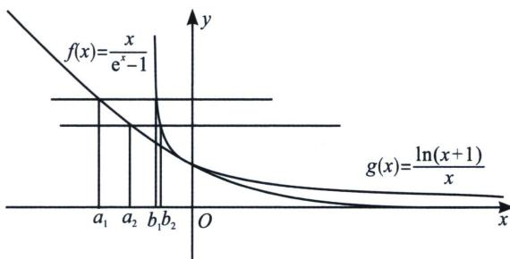

<!-- question-source:start -->
例11 (2021·多选·水哥供题)若实数 $a$ 、 $b$ 满足 $ab = (e^a - 1)\ln(1 + b)$ ，则下列选项正确的有（）
A. 若 $b < 0$ ，则 $a < 0$ B. 若 $a > 0$ ，则 $b < a + \frac{b^2}{2}$ C. 存在实数 $a$ 、 $b$ ，使得 $|a - b| = \sqrt{2}$ D. 设 $(a_1, b_1)$ ， $(a_2, b_2)$ 为满足等式的两组数，则当 $a_1 < 0$ ， $a_2 < 0$ 时， $|a_1 - a_2| < |b_1 - b_2|$

对于 B，由已知得 $\frac{a}{e^{a}-1}=\frac{\ln(1+b)}{b}$ ，令 $f(x)=\frac{x}{e^{x}-1}$ ， $g(x)=\frac{\ln(1+x)}{x}$ ，易知 $f(x)$ 和 $g(x)$ 均为减函数，且 $f(\ln(x+1))=g(x)$ ，故 $f(\ln(1+b))=\frac{\ln(1+b)}{\mathrm{e}^{(\ln(1+b))}-1}=\frac{\ln(1+b)}{b}=\frac{\mathrm{e}^{a}-1}{a}=f(a)\Rightarrow a=\ln(1+b)$ ，要证明 $b<a+\frac{b^{2}}{2}$ ，故只需证 $\frac{b^{2}}{2}-b+\ln(1+b)>0$ ，令 $h(x)=\frac{x^{2}}{2}+\ln(1+x)-x$ ，则 $h'(x)=x-1+\frac{1}{1+x}=x+1+\frac{1}{x+1}-2\geqslant0$ ， $h(x)$ 为增函数， $g(0)=0$ ，所以 $h(x)>0$ ， $b<\ln(1+b)+\frac{b^{2}}{2}$ ，故 B 正确；对于 C，由于 $a=\ln(1+b)$ ， $|a-b|=\sqrt{2}$ ，则 $|b-\ln(b+1)|=\sqrt{2}$ ，一定有解，C 正确；

对于 D，由于 $x \geqslant \ln(1 + x)$ ， $f(x)$ 和 $g(x)$ 均为减函数，则 $f(x) \leqslant f(\ln(x + 1)) = g(x)$ ，作出两函数图知， $(a_{1}, b_{1})$ ， $(a_{2}, b_{2})$ 为满足等式的两组数，则 $f(a_{1}) = g(b_{1}) = y_{1}$ ， $f(a_{2}) = g(b_{2}) = y_{2}$ ，当 $a_{1} < 0$ ， $a_{2} < 0$ 时， $y_{1} > y_{2} > 0$ ，有相同 $\Delta y$ ，分析两函数的 $\Delta x$ ，显然 $f(x)$ 递减更缓慢，如图，一定有 $|a_{1} - a_{2}| > |b_{1} - b_{2}|$ ，故 D 错误，故选 BC.

<!-- question-source:end -->
