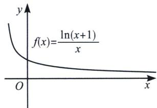
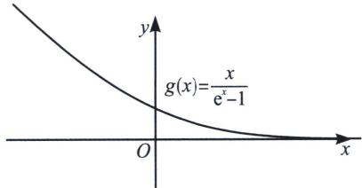

<!-- question-source:start -->
例 9 (2025 春·静安区高二期末 T17) 设函数 $f(x) = \mathrm{e}^{x} - ax, a \in \mathbf{R}$ .

(1) 讨论 $y = f(x)$ 的单调性；

(2) 当 $x \geqslant 0$ 时， $f(x) \geqslant (x + 1)^{2}$ 恒成立，求 a 的取值范围.

(1) $f(x)=\mathrm{e}^{x}-ax,\ f'(x)=\mathrm{e}^{x}-a$ ，当a<0， $f'(x)=\mathrm{e}^{x}-a>0,\ f(x)\uparrow$ ，当a>0， $f'(x)=$

$$
\mathrm{e} ^ {x} - a = 0 \Rightarrow x = \ln a, \left\{ \begin{array}{l l} x <   \ln a, & f ^ {\prime} (x) <   0, f (x) \downarrow \\ x > \ln a, & f ^ {\prime} (x) > 0, f (x) \uparrow \end{array} ; \right.
$$

(2) 设 $g(x)=f(x)-(x+1)^{2}=e^{x}-ax-(x+1)^{2}$ ，则 $g(0)=0$ ，即证 $g(x)\geqslant0$ ， $g(x)=x\left[\frac{e^{x}-(x+1)^{2}}{x}-a\right]\geqslant0$ ，令 $h(x)=\frac{e^{x}-(x+1)^{2}}{x}$ ， $h'(x)=\frac{(e^{x}-x-1)(x-1)}{x^{2}}$ ， $\left\{\begin{aligned}x<1, & h'(x)<0, & h(x)\downarrow \\ x>1, & h'(x)>0, & h(x)\uparrow\end{aligned}\right.$

所以 $a \leqslant h(x)_{\min} = h
(1) = \mathrm{e} - 4$

## 三、切线与最值等效转化

通常切线意味着函数最值，比如说 $\frac{\mathrm{e}^x}{x} \geqslant \mathrm{e} \Leftrightarrow \mathrm{e}^x \geqslant \mathrm{e}x (x > 0)$ ， $\frac{\ln x}{x} \leqslant \frac{1}{\mathrm{e}} \Leftrightarrow \ln x \leqslant \frac{1}{\mathrm{e}} x (x > 0)$ ，这是我们经常说到的六大函数可以直接跟切线放缩挂钩，本质来说他们也是一体的，切线可以转化为最值，最值也能转化为切线，通常我们建议大家按照最值理解，因为单个函数好处理，一旦变成两个函数比大小，变量就会增多。

我们来分析一组同构函数，也是由切线转化而来的共零点函数，即 $f(x)=\frac{\ln(x+1)}{x}$ 与 $g(x)=\frac{x}{e^{x}-1}$ ，根据同构知识易知 $f(x)=g(\ln(x+1))$ ，我们来做一下两个函数图像， $f'(x)=\frac{\frac{x}{x+1}-\ln(x+1)}{x^2}$ ，取 $h(x)=\frac{x}{x+1}-\ln(x+1)=1-\frac{1}{x+1}-\ln(x+1)\leqslant0$ （利用 $\ln x\geqslant1-\frac{1}{x}$ 恒成立，x=1取等），所以 $f(x)$ 单调递减，当 $x\to0$ 时，分子分母出现了 $\frac{0}{0}$ ，但是这里是有意义的，根据 $x\geqslant\ln(x+1)$ 在x=0时取等可知， $f(0)=1$ ，当然也可以根据洛必达法则得出结果，不过涉及一点大学知识，我们会在本书后续章节介绍.

<!-- question-source:end -->

![[高中/总复习/专题/2026版高中《mst老唐说题》导数专题（数学）/上册/第01章_技能篇_导数基本技能/第三节_指对处理的基本方法/例题/answers/Q00046350A1.md]]
