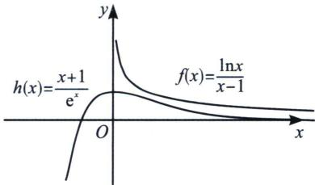

<!-- question-source:start -->
例13 (2023·河北月考T21)已知函数 $f(x)=\frac{\ln x}{x-1}$ .

(1)求 $f(x)$ 的单调区间；

(2)证明： $f(x)>\frac{x+1}{\mathrm{e}^{x}}$ （其中e是自然对数的底数， $e=2.71828\cdots$ ）.

(1) 定义域是 $(0, 1) \cup (1, +\infty)$ , $f'(x) = \frac{1 - \frac{1}{x} - \ln x}{(x - 1)^2}$ , 令 $u(x) = 1 - \frac{1}{x} - \ln x$ , 则 $u'(x) = \frac{1 - x}{x^2}$ , 所以 $u(x)$ 在 $(0, 1)$ 递增, 在 $(1, +\infty)$ 递减, 故 $x \in (0, 1) \cup (1, +\infty)$ 时, $u(x) < u (1) = 0$ ,也即 $f'(x)<0$ ，因此 $f(x)$ 在 $(0,1)$ 上单调递减；在 $(1,+\infty)$ 上也单调递减；

(2)分析：我们参考六大函数可知 $h(x)=\frac{x+1}{\mathrm{e}^{x}}=\mathrm{e}\cdot\frac{x+1}{\mathrm{e}^{x+1}}\leqslant1$ ，当且仅当 $x+1=1$ ，即x=0时取等， $f(x)=\frac{\ln x}{x-1}$ 在 $(0,+\infty)$ 递减，且由 $x-1\geqslant\ln x(x=1$ 取等)，可知 $f
(1)=1$ ，在 $x\in(0,1)$ 时，可以证 $f(x)>1>h(x)$ ，当x>1时，两函数都是单调递减，故此时我们可以构造函数或者放缩式证明。
法一（对数单身狗，指数找基友）：即证明 $\frac{\ln x}{x-1}>\frac{x+1}{\mathrm{e}^{x}}$ ， $x\in(0,1)\cup(1,+\infty)$ ，①先证明 $x\in(1,+\infty)$ 时的情况：此时问题等价于 $\ln x-\frac{x^{2}-1}{\mathrm{e}^{x}}>0$ ，令 $g(x)=\ln x-\frac{x^{2}-1}{\mathrm{e}^{x}}$ ， $g'(x)=\frac{\mathrm{e}^{x}+x^{3}-2x^{2}-x}{x\mathrm{e}^{x}}$ 令 $t(x)=\mathrm{e}^{x}+x^{3}-2x^{2}-x$ ，则 $t'(x)=\mathrm{e}^{x}+3x^{2}-4x-1$ ， $t''(x)=\mathrm{e}^{x}+6x-4>0$ ， $(x>1)$ ，故 $t'(x)$ 在 $(1,+\infty)$ 递增，故 $t'(x)>t'
(1)=\mathrm{e}-2>0$ ，故 $h(x)$ 在 $(1,+\infty)$ 递增，于是 $t(x)>t (1)=\mathrm{e}-2>0$ ，故 $g'(x)>0$ ，故 $g(x)$ 在 $(1,+\infty)$ 递增，因此 $x\in(1,+\infty)$ 时， $g(x)>g (1)=0$ ，即 $\ln x-\frac{x^{2}-1}{\mathrm{e}^{x}}>0$ ②下面证明 $x\in(0,1)$ 时的情况：令 $m(x)=\mathrm{e}^{x}-x-1$ ， $g'(x)=\mathrm{e}^{x}-1>0$ ，故m(x)在[0,1)递增，于是 $x\in(0,1)$ 时， $m(x)>m(0)=0$ ，故 $\frac{x+1}{\mathrm{e}^{x}}<1$ ，令 $n(x)=\ln x-x+1$ ， $n'(x)=\frac{1-x}{x}>0$ ，故n(x)
在 $(0,1]$ 递增，故 $x\in(0,1)$ 时， $n(x)<n
(1)=0$ ，即 $\ln x-x+1<0$ ，即 $\frac{\ln x}{x-1}>1>\frac{x+1}{\mathrm{e}^{x}}$ ，证毕。
法二（帕德放缩）：构造 $g(x)=\ln x-\frac{2(x-1)}{x+1}$ ，则 $g'(x)=\frac{1}{x}-\frac{4}{(x+1)^{2}}=\frac{(x-1)^{2}}{x(x+1)^{2}}\geqslant0$ ，而 $f
(1)=0$ ，故当0<x<1时， $\ln x<\frac{2(x-1)}{x+1}$ ；当 $x\geqslant1$ 时， $\ln x\geqslant\frac{2(x-1)}{x+1}$ ①先证明 $x\in(1,+\infty)$ 时的情况：要证： $\ln x-\frac{x^{2}-1}{\mathrm{e}^{x}}\geqslant\frac{2(x-1)}{x+1}-\frac{x^{2}-1}{\mathrm{e}^{x}}>0$ ，故只需证 $\frac{2}{x+1}>\frac{x+1}{\mathrm{e}^{x}}$ ，故只需证 $1>\frac{(x+1)^{2}}{2\mathrm{e}^{x}}$ ，构造 $p(x)=\frac{(x+1)^{2}}{2\mathrm{e}^{x}}$ ， $p'(x)=\frac{-x^{2}+1}{2\mathrm{e}^{x}}$ ，显然 $p(x_{\max}=p (1)=\frac{2}{\mathrm{e}}<1$ ，
②下面证明 $x\in(0,1)$ 时的情况：此时问题等价于 $\ln x-\frac{x^{2}-1}{\mathrm{e}^{x}}<\frac{2(x-1)}{x+1}-\frac{x^{2}-1}{\mathrm{e}^{x}}<0$ ，故只需证 $\frac{2}{x+1}>\frac{x+1}{\mathrm{e}^{x}}$ ，故只需证 $1>\frac{(x+1)^{2}}{2\mathrm{e}^{x}}$ ，显然 $p(x_{\max}=h
(1)=\frac{2}{\mathrm{e}}<1$ ，证毕。

注意：通常比切线精度更高的对数放缩，我们选择一飘一帕，即

$$
\left\{ \begin{array}{l} \frac {2 (x - 1)}{x + 1} > \ln x > \frac {1}{2} \left(x - \frac {1}{x}\right) (\text {当} 0 <   x <   1) \\ \frac {2 (x - 1)}{x + 1} <   \ln x <   \frac {1}{2} \left(x - \frac {1}{x}\right) (\text {当} x > 1) \end{array} \right.
$$

下面我们继续证明一些切线构造的函数最值，这些经常出现在一些放缩和找点的高考题中.
<!-- question-source:end -->

![[高中/总复习/专题/2026版高中《mst老唐说题》导数专题（数学）/上册/第01章_技能篇_导数基本技能/第三节_指对处理的基本方法/例题/answers/Q00046354A1.md]]
