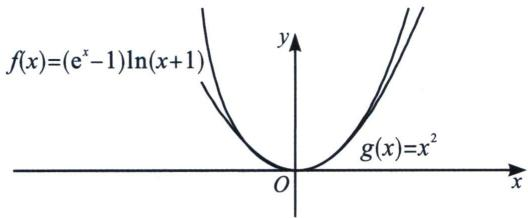
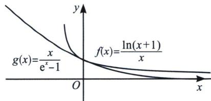

> [!faq]- 《导数专题(上)》例题解析
>
> > [!success]- **【答案】** 详见解析
>
> > [!note]- **【分析】**
> > 本题未单列分析。
>
> > [!note]- **【解析】**
> > 解析 法一(放缩法): 指对跨阶不等式, 根据“放对再放指, 不行找基友”的原理, 由于 $x = 0$ 时, 两边均为零, 故可以考虑对数在 $x = 0$ 处的切线放缩, 不等号方向必须一致, 由于 $x \geqslant 1$ 时, $\ln x \geqslant \frac{2(x - 1)}{x + 1}$ , 故 $x \geqslant 0$ 时, $\ln (x + 1) \geqslant \frac{2x}{x + 2}$ , 故只需证 $(\mathrm{e}^{x} - 1)\frac{2}{x + 2} \geqslant x (x \geqslant 0)$ , 即证 $\mathrm{e}^{x} \geqslant \frac{x^{2} + 2x}{2} + 1 (x \geqslant 0)$ , 构造 $h(x) = \frac{x^{2} + 2x + 2}{2\mathrm{e}^{x}}$ , 易得 $h'(x) = \frac{-x^{2}}{2\mathrm{e}^{x}}$ , 故 $h(x)_{\max} = h(0) = 1$ , 故 $(\mathrm{e}^{x} - 1)\ln (x + 1) \geqslant x^{2}(x \geqslant 0)$ 成立. 同理, 当 $-1 < x \leqslant 0$ 时, 易证 $\ln (x + 1) \leqslant \frac{2x}{x + 2} \leqslant 0$ , $\mathrm{e}^{x} - 1 \leqslant \frac{x^{2} + 2x}{2} \leqslant 0$ , 则 $-\ln (x + 1) \geqslant -\frac{2x}{x + 2} \geqslant 0$ , $-(e^{x} - 1) \geqslant \frac{x^{2} + 2x}{2} \geqslant 0$ , 所以 $[- (e^{x} - 1)] \cdot [-\ln (x + 1)] = (e^{x} - 1)\ln (x + 1) \geqslant x^{2}$ .
> > $(-1<x\leqslant0)$ . 综上 $(e^{x}-1)\ln(x+1)\geqslant x^{2}(x>-1)$ .
> > 
> > 
> > $$
> > \left(\mathrm{e} ^ {x} - 1\right) \ln (x + 1) \geqslant x ^ {2} (x > - 1)
> > $$
> > $$
> > \frac {x}{\mathrm{e} ^ {x} - 1} \leqslant \frac {\ln (x + 1)}{x}
> > $$
> > $$
> > f (x) = \frac {\ln (x + 1)}{x}
> > $$
> > $f'(x)=\frac{\frac{x}{x+1}-\ln(x+1)}{x^{2}}$ ，取 $h(x)=\frac{x}{x+1}-\ln(x+1)$ ， $h'(x)=\frac{1}{(x+1)^{2}}-\frac{1}{x+1}=\frac{-x}{(x+1)^{2}}$ ，显然 $h(x)$ 在 $(-1,0)$ 单调递增，在 $(0,+\infty)$ 单调递减， $h(x)_{\max}=h(0)=0$ ，所以 $f'(x)\leqslant0$ 恒成立，所以 $f(x)$ 单调递减，当x=0时，由于 $x\geqslant\ln(x+1)$ 在x=0处取等，故 $f(0)=1$ ，令 $g(x)=\frac{x}{e^{x}-1}$ ，则 $g(x)=f(e^{x}-1)$ ，易证 $e^{x}-1\geqslant x$ ，当且仅当x=0成立，故 $f(0)=g(0)=1$ ，由于 $f(x)$ 单调递减，故 $f(x)\geqslant f(e^{x}-1)=g(x)$ ，命题得证.
> > 注意: 本题利用了同构函数是一种特殊的复合函数, 我们可以表示 $g(x) = f(\mathrm{e}^{x} - 1)$ , 也可以表示为 $f(x) = g(\ln (x + 1))$ , 只要分析一个母函数(外函数)即可证明.
