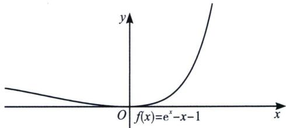
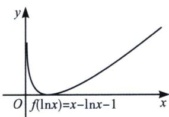

## 一、两大基本切线式

如图 1 所示，令 $f(x)=\mathrm{e}^{x}-x-1$ ， $f'(x)=\mathrm{e}^{x}-1=0$ 时，x=0，故 $f(x)$ 在区间 $(-∞,0)$ 单调递减，在区间 $(0,+\infty)$ 单调递增， $f(x)_{\min}=f(0)=0$ ;

如图 2 所示， $g(x)=f(\ln x)=x-\ln x-1$ ，当 $\ln x\in(-\infty,0)$ ，即 $x\in(0,1)$ ， $g(x)$ 单调递减，当 $\ln x\in(0,+\infty)$ ，即 $x\in(1,+\infty)$ ， $g(x)$ 单调递增， $g(x)_{\min}=g(1)=0$ ；

  
图1

  
图 2

![[高中/总复习/专题/2026版高中《mst老唐说题》导数专题（数学）/上册/第01章_技能篇_导数基本技能/第二节_切线函数的基本应用/一_两大基本切线式/例题/Q00052591.md]]
![[高中/总复习/专题/2026版高中《mst老唐说题》导数专题（数学）/上册/第01章_技能篇_导数基本技能/第二节_切线函数的基本应用/一_两大基本切线式/例题/Q00052592.md]]
![[高中/总复习/专题/2026版高中《mst老唐说题》导数专题（数学）/上册/第01章_技能篇_导数基本技能/第二节_切线函数的基本应用/一_两大基本切线式/例题/Q00052593.md]]
