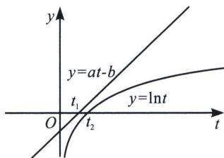

> [!faq]- 《导数专题(上)》例题解析
>
> > [!success]- **【答案】** B
>
> > [!note]- **【分析】**
> > 本题未单列分析。
>
> > [!note]- **【解析】**
> > 解析 因为函数 $f(x)=ae^{x}$ ， $g(x)=2x+b$ ，且 $f(x)\geqslant g(x)$ 恒成立，所以当a<0时， $f(x)$ 是单调减函数，且 $f(x)<0$ ， $g(x)$ 是单调增函数， $g(x)$ 的值域是R，显然不满足题意；
> > 法一：当 $a > 0$ 且 $b > 0$ 时，由 $f(x) \geqslant g(x)$ 得， $ae^x \geqslant 2x + b$ ， $\mathrm{e}^x \geqslant x + 1 \Leftrightarrow \mathrm{e}^{x + \ln a - \ln 2} \geqslant x + \ln a - \ln 2 + 1 \geqslant x + \frac{b}{2}$ ，此时 $\frac{b}{2} = \ln \frac{a}{2} + 1$ ， $\frac{b}{a} = \frac{2\ln \frac{ae}{2}}{a} = e \cdot \frac{\ln \frac{ae}{2}}{\frac{ae}{2}} \leqslant 1$ ，此时 $a = b = 2$ ，即 $\frac{b}{a}$ 的最大值是 1，选 B. 法二（零点比大小）：如图，利用函数凹凸性构造 $ae^x - b \geqslant 2x$ ，令 $t = e^x (t > 0)$ ，即 $at - b \geqslant 2\ln t$ ，由于 $h(t) = at - b$ 零点为 $t_1 = \frac{b}{a}$ ， $p(t) = \ln t$ 的零点为 $t_2 = 1$ ，故 $t_1 \leqslant t_2 = 1$ ；故选 B.
> > 
