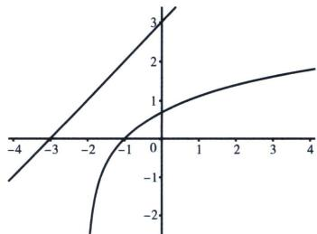

> [!faq]- 《导数专题(上)》例题解析
>
> > [!success]- **【答案】** B
>
> > [!note]- **【分析】**
> > 本题未单列分析。
>
> > [!note]- **【解析】**
> > 解析 法一：当 $a > 0$ 且 $b > 0$ 时，由 $f(x) \geqslant g(x)$ 得， $f(x) = ax + b$ ，令 $\ln (x + 2) = t$ ，即 $ae^t - 2a + b$ $\geqslant t,\mathrm{e}^{x}\geqslant x+1\Leftrightarrow\mathrm{e}^{t+\ln a}\geqslant t+\ln a+1\geqslant t+2a-b$ ，取等时 $\frac{b}{a}\geqslant2-\frac{\ln a+1}{a}=2-\mathrm{e}\frac{\ln(\mathrm{e}a)}{\mathrm{e}a}\geqslant1$ ，此时a=b=1，即 $\frac{b}{a}$ 的最小值是1，故选B.
> > 法二(零点比大小): $f(x) = ax + b = 0$ , $x = -\frac{b}{a}$ , 令 $g(x) = \ln (x + 2) = 0$ , 即 $x = -1$ , 如图: 当两个函数共零点且在零点处相切时, $-\frac{b}{a}$ 有最大值 $-1$ , 故 $-\frac{b}{a} \leqslant -1 \Leftrightarrow \frac{b}{a} \geqslant 1$ , 故选 B.
> > 
> > 法三： $\ln(x+2)\leqslant ax+b\Leftrightarrow\ln(x+2)+\ln a\leqslant a(x+2)+b+\ln a$ ，又有 $\ln a(x+2)\leqslant a(x+2)+1$ ，故 $\ln a(x+2)\leqslant a(x+2)-1\leqslant a(x+2)+b+\ln a-2a\Leftrightarrow b\geqslant-\ln a-1+2a\Leftrightarrow\frac{b}{a}\geqslant2-\frac{\ln a+1}{a}\geqslant1$ ，故选B.
> > ## 三、朗博同构引发的切线放缩
> > 朗博函数指的是形如 $x^n \cdot \mathrm{e}^x$ 或 $a\mathrm{e}^x$ 类型的函数， $a > 0, x > 0$ ，将积式拿到指数里，进行切线构造，比如 $x \cdot \mathrm{e}^x = \mathrm{e}^{\ln x + x}, a\mathrm{e}^x = \mathrm{e}^{\ln a + x}, \frac{\mathrm{e}^x}{x} = \mathrm{e}^{x - \ln x}$ ；关于朗博函数我们统一往 $f(x) = \mathrm{e}^x - x - 1$ 进行同构， $f(x) \geqslant 0$ 恒成立，当且仅当 $x = 0$ 时等号成立。
> > $x\mathrm{e}^{x}\geqslant x+\ln x+1$ .（用 $x+\ln x$ 替换x，切点横坐标满足 $x_{0}+\ln x_{0}=0,\quad x_{0}\approx0.567$ )常见的指对跨阶模型，切线的方程是按照指数函数给予的.
