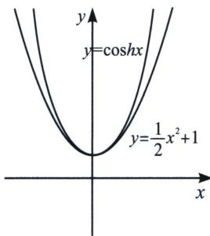
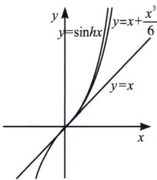

## 二、泰勒展开与双曲正弦余弦函数(含飘带函数)

根据 $\mathrm{e}^x\geqslant \frac{1}{6} x^3 +\frac{1}{2} x^2 +x + 1$ ， $\mathrm{e}^{-x}\geqslant -\frac{1}{6} x^3 +\frac{1}{2} x^2 -x + 1$ ，两式相加即得 $h(x) = \mathrm{e}^{x} + \mathrm{e}^{-x} - 2 - x^{2}$ $\geqslant 0$ ，当 $x = 0$ 时取“ $=$ ”， $x\in \mathbb{R}$ 时恒成立；由此我们能得出一个新的总结归纳，如下：

$$
\mathrm{e} ^ {x} \geqslant 1 + x + \frac {1}{2} x ^ {2} + \frac {1}{6} x ^ {3} + \frac {1}{2 4} x ^ {4} + \frac {1}{1 2 0} x ^ {5} (①; \mathrm{e} ^ {- x} \geqslant 1 - x + \frac {1}{2} x ^ {2} - \frac {1}{6} x ^ {3} + \frac {1}{2 4} x ^ {4} - \frac {1}{1 2 0} x ^ {5} (②
$$

①+②得： $e^{x}+e^{-x}\geqslant2+x^{2}+\frac{1}{12}x^{4}$ ，我们综合总结归纳可得： $\frac{e^{x}+e^{-x}}{2}\geqslant1+\frac{1}{2!}x^{2}+\frac{1}{4!}x^{4}+\cdots$ 由于 $\cosh x=\frac{e^{x}+e^{-x}}{2}$ ，我们称之为双曲余弦函数，那么它的泰勒展开式我们也随即推导

同理，我们可以得到双曲正弦函数，当 $x \geqslant 0$ ，记 $\sinh x = \frac{e^{x} - e^{-x}}{2} \geqslant x + \frac{x^{3}}{6} + \frac{x^{5}}{5!} + \cdots$

令 $e^{x}=t$ ，则会有 $\frac{t}{2}-\frac{1}{2t}\geqslant\ln t+\frac{1}{6}(\ln t)^{3}+\cdots$ ，最经典的代表就是飘带函数 $\frac{1}{2}\left(t-\frac{1}{t}\right)\geqslant\ln t(t\geqslant$

1)，同理，我们也可以推出 $t - \frac{1}{t} < 2\ln t + \frac{(\ln t)^3}{3} (0 < t < 1)$

另外，由于双曲余弦函数是偶函数，双曲正弦函数是奇函数，

易知当 $x \leqslant 0$ 时， $\sinh x = \frac{e^{x} - e^{-x}}{2} \leqslant x + \frac{x^{3}}{6} + \frac{x^{5}}{5!} + \cdots$ （如右图），而 $\cosh x = \frac{e^{x} + e^{-x}}{2} \geqslant 1 + \frac{1}{2!} x^{2} + \frac{1}{4!} x^{4} + \cdots$ 依然成立.

我们再来分析一下对数的泰勒展开 $\ln(1+x)=x-\frac{x^{2}}{2}+\frac{x^{3}}{3}+\cdots+(-1)^{n-1}\frac{x^{n}}{n}+o(x^{n})$ ，我们能得到

$\ln (1 - x) = -x - \frac{x^2}{2} -\frac{x^3}{3} -\frac{x^4}{4} -\frac{x^5}{5}\dots$ ，即 $\left\{ \begin{array}{l}\ln (1 + x) > x - \frac{x^2}{2} (x > 0)\\ \ln (1 - x) <   - x - \frac{x^2}{2} (x > 0) \end{array} \right.$ ，两式相减得： $\ln \frac{1 + x}{1 - x} >$ $2x(x > 0)$ ，令 $\frac{1 + x}{1 - x} = t(t > 1)$ ，则有 $x = \frac{t - 1}{t + 1}$ ，故 $\ln t > \frac{2(t - 1)}{t + 1}(t > 1)$ ，同理也能证明 $\ln t <   \frac{2(t - 1)}{t + 1}(0$ $<t<1)$ ，这就是我们经常用来放缩估值的帕德逼近 $R_{1,1}(x)$ ，我们可以进行泰勒加强，即 $\left\{\begin{aligned}\ln(1+x)>x-\frac{x^{2}}{2}+\frac{x^{3}}{3}-\frac{x^{4}}{4}(x>0)\\ \ln(1-x)<-x-\frac{x^{2}}{2}-\frac{x^{3}}{3}-\frac{x^{4}}{4}(x>0)\end{aligned}\right.$ ，两式相减得： $\ln\frac{1+x}{1-x}>2x+\frac{2x^{3}}{3}(x>0)$ 令 $\frac{1+x}{1-x}=t(t>1)$ ，则有 $x=\frac{t-1}{t+1}$ ，故 $\ln t>\frac{2(t-1)}{t+1}+\frac{2(t-1)^{3}}{3(t+1)^{3}}(t>1)$ ,
同理也能证明 $\ln t < \frac{2(t-1)}{t+1} + \frac{2(t-1)^{3}}{3(t+1)^{3}} (0 < t < 1)$ .

![[高中/总复习/专题/2026版高中《mst老唐说题》导数专题（数学）/上册/第01章_技能篇_导数基本技能/第五节_泰勒展开的基本应用/二_泰勒展开与双曲正弦余弦函数_含飘带函数_/例题/Q00047023.md]]
![[高中/总复习/专题/2026版高中《mst老唐说题》导数专题（数学）/上册/第01章_技能篇_导数基本技能/第五节_泰勒展开的基本应用/二_泰勒展开与双曲正弦余弦函数_含飘带函数_/例题/Q00052615.md]]
