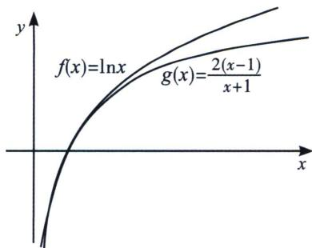
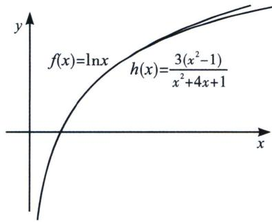
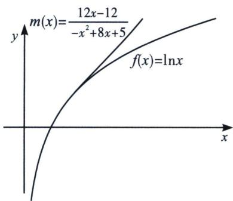
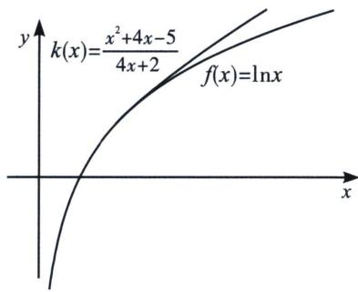

> [!faq]- 《导数专题(上册)》例题解析
>
> > [!success]- **【答案】** 解析
>
> > [!note]- **【解析】**
> > 【分析】我们发现 $f(1)=0$ ，故 $f(x)>0\Rightarrow f(x)>f(1)$ ，这类端点处出现最值的类型，我们称之为端点效应，只需要端点处导函数大于等于0，保证之后都是递增即可，一旦端点处导函数为负，则会出现负值，与题意不符合，我们需要证明端点处导函数为正的情况成立，还要证明为负情况的矛盾.
> >
> > 解答：由 $f'(x)=1+\frac{1}{x}+\ln x-a$ ， $f''(x)=\frac{x-1}{x^{2}}$ ，因为x>1，所以 $f''(x)>0$ ，所以 $f'(x)$ 在 $(1,+\infty)$ 上单调递增，所以 $f'(x)>f'(1)=2-a$ 。
> > - **①**：$a\leqslant2$ ， $f'(x)>f'(1)\geqslant0$ ，所以 $f(x)$ 在 $(1,+\infty)$ 上单调递增，所以 $f(x)>f(1)=0$ ，满足题意；
> > - **②**：a>2， $f'(1)<0$ ， $f'(x)=1+\frac{1}{x}+\ln x-a>\ln x+1-a=0$ ，取 $x=e^{a-1}$ ， $f'(e^{a-1})>0$ ，存在 $x_{0}\in(1,e^{a-1})$ ，使 $f'(x_{0})=0$ ，函数 $f(x)$ 在 $(1,x_{0})$ 上单调递减，在 $(x_{0},+\infty)$ 上单调递增，由 $f(1)=0$ ，可得存在 $x_{1}\in(1,+\infty)$ ， $f(x_{1})<0$ ，不合题意，综上所述， $a\leqslant2$ .
> >
> > 我们再列举一些常见的帕德逼近，先看指数的：
> >
> > <table><tr><td> $f(x)=\mathrm{e}^{x}$ </td><td>0</td><td>1</td><td>2</td></tr><tr><td>0</td><td>1(先大后小)</td><td> $x+1$ (恒小于)</td><td> $\frac{x^{2}+2x+2}{2}$ (先大后小)</td></tr><tr><td>1</td><td> $\frac{1}{1-x}$ (恒大于)</td><td> $\frac{2+x}{2-x}$ (先小后大)</td><td> $\frac{x^{2}+4x+6}{-2x+6}$ (恒大于)</td></tr><tr><td>2</td><td> $\frac{2}{x^{2}-2x+2}$ (先大后小)</td><td> $\frac{2x+6}{x^{2}-4x+6}$ (恒小于)</td><td> $\frac{x^{2}+6x+12}{x^{2}-6x+12}$ (先大后小)</td></tr></table>
> >
> > 将 $\ln(x+1)$ 向右平移一个单位后，得到 $\ln x$ ，我们列举一下常见的帕德逼近：
> >
> > <table><tr><td> $f(x)=\ln x$ </td><td>0</td><td>1</td><td>2</td></tr><tr><td>0</td><td></td><td> $x-1$ (恒大于)</td><td> $\frac{-x^{2}+4x-3}{2}$ (先大后小)</td></tr><tr><td>1</td><td></td><td> $\frac{2(x-1)}{x+1}$ (先大后小)</td><td> $\frac{x^{2}+4x-5}{4x+2}$ (恒大于)</td></tr><tr><td>2</td><td></td><td> $\frac{12(x-1)}{-x^{2}+8x+5}$ (恒大于)</td><td> $\frac{3x^{2}-3}{x^{2}+4x+1}$ (先大后小)</td></tr></table>
> >
> > 我们通过作图来分析逼近程度，我们发现，两个先大后小的逼近函数，显然 $R_{2,2}(x) = \frac{3x^2 - 3}{x^2 + 4x + 1}$ 比 $R_{1,1}(x) = \frac{2(x - 1)}{x + 1}$ 的逼近效果更好，两个恒大于的，显然 $R_{2,1}(x) = \frac{x^2 + 4x - 5}{4x + 2}$ 比
> >
> > $R_{1,2}(x) = \frac{12(x - 1)}{-x^2 + 8x + 5}$ 的逼近效果更好，
> >
> > 
> >
> > 
> >
> > 
> >
> > 
