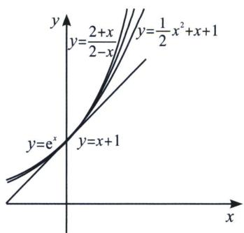
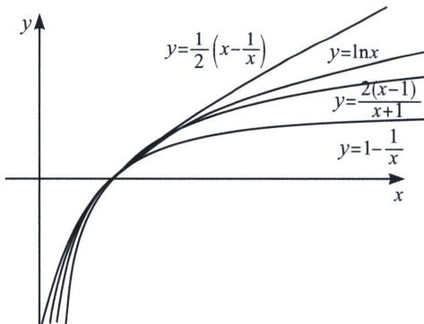
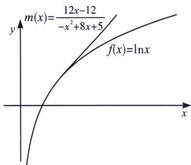
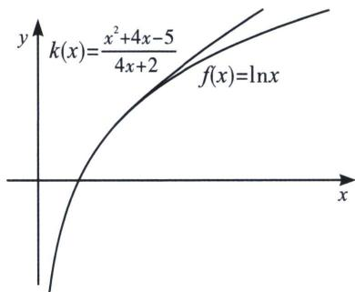

## 二、帕德逼近与估值

相比于泰勒展开的近似数估算，我们发现如果泰勒某些情况精度不足，而且不等号方向相对固定，这就是泰勒展开的问题，我们估值需要但一个上下界限，所以帕德逼近和泰勒展开合体时，我们就能发现指数和对数都有了上下界，我们通常做如下处理：

当 $x \to 0^{+}$ 时， $\frac{2 + x}{2 - x} > \mathrm{e}^{x} > \frac{1}{2} x^{2} + x + 1 > x + 1$ （左图）；

当 $x \to 1^{+}$ 时， $\frac{1}{2} \left(x - \frac{1}{x}\right) > \ln x > \frac{2(x - 1)}{x + 1} > 1 - \frac{1}{x}$ (右图);

由于飘带不等式和帕德逼近都是在 $x = 1$ 附近取得近似数，当在 $x = x_0$ 处取得近似数时，我们可以如下处理， $\left\{ \begin{array}{l} \ln x > \frac{2(x - 1)}{x + 1} (x > 1) \\ \ln x < \frac{2(x - 1)}{x + 1} (0 < x < 1) \end{array} \right.$ ， $\left\{ \begin{array}{l} \ln \frac{x}{x_0} > \frac{2(x - x_0)}{x + x_0} (x > x_0) \\ \ln \frac{x}{x_0} < \frac{2(x - x_0)}{x + x_0} (0 < x < x_0) \end{array} \right.$ 显然是一个相对紧密型的逼近，同理我们考虑飘带函数 $\left\{ \begin{array}{l} \ln x > \frac{1}{2}\left(x - \frac{1}{x}\right) \\ \ln x < \frac{1}{2}\left(x - \frac{1}{x}\right) \end{array} \right.$ （当 $0 < x < 1$ ），故采取 $\left\{ \begin{array}{l} \ln \frac{x}{x_0} > \frac{1}{2}\left(\frac{x}{x_0} - \frac{x_0}{x}\right) \\ \ln \frac{x}{x_0} < \frac{1}{2}\left(\frac{x}{x_0} - \frac{x_0}{x}\right) \end{array} \right.$ （当 $0 < x < x_0$ ），

![[高中/总复习/专题/2026版高中《mst老唐说题》导数专题（数学）/上册/第01章_技能篇_导数基本技能/第六节_帕德逼近的基本原理/二_帕德逼近与估值/例题/Q00047030.md]]
