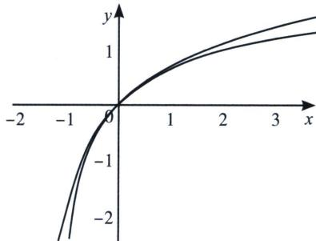

> [!faq]- 《导数专题(上)》例题解析
>
> > [!success]- **【答案】** 详见解析
>
> > [!note]- **【分析】**
> > 本题未单列分析。
>
> > [!note]- **【解析】**
> > 解析 由定义可知， $f(x)$ 的 $[1, 1]$ 阶帕德逼近为： $R(x)=\frac{a_0+a_1x}{1+b_1x}$ ，且满足 $f(0)=R(0)$ ，可得： $a_0=0$ 。 $f'(x)=\frac{1}{1+x}$ ， $R'(x)=\frac{a_1}{(1+b_1x)^2}$ ，再由定义可知，需满足： $f'(0)=R'(0)\Rightarrow a_1=1$ 。同理再由 $f''(0)=R''(0)\Rightarrow b_1=\frac{1}{2}$ ，于是可得到 $f(x)$ 的 $[1, 1]$ 阶帕德逼近为： $R(x)=\frac{2x}{x+2}$
> > 
> > 如图，-1<x<0 时， $\ln(x+1)<\frac{2x}{x+2}$ ; x>0 时， $\ln(x+1)>\frac{2x}{x+2}$ ，若将上述不等式中 x 换成 x-1，
> > 便可得到当 $x \geqslant 1$ 时， $\frac{2(x-1)}{(x+1)} \leqslant \ln x$ ，当 $0 < x \leqslant 1$ 时， $\ln x \leqslant \frac{2(x-1)}{x+1}$ .
