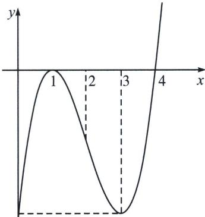

<!-- question-source:start -->
例19 (24新Ⅰ卷第10题·多选)设函数 $f(x)=(x-1)^{2}(x-4)$ ，则
A. x=3 是 $f(x)$ 的极小值点    B. 当 0<x<1 时， $f(x)<f(x^{2})$ C. 当 1<x<2 时， $-4<f(2x-1)<0$ D. 当 -1<x<0 时， $f(2-x)>f(x)$

(1) > f(2x - 1) > f
(3)$ ，即 $-4 < f(2x - 1) < 0$ ，正确；

对 D，当 -1 < x < 0 时， $f(2 - x) - f(x) = (1 - x)^{2} (-2 - x) - (x - 1)^{2} (x - 4) = (x - 1)^{2}$ $(2-2x)>0$ ，所以 $f(2-x)>f(x)$ ，正确；

法二：利用零点穿根和三次函数四段论，简化处理，由于两个零点 $x_{1} = 1$ （偶回）， $x_{2} = 4$ （奇穿），故我们能作出其图像，结合四段论的理论，对称中心为 $(2, -2)$ ， $x = 1$ 为极大值点， $x = 3$ 为极小值点，A 正确；函数 $f(x)$ 在 $(0, 1)$ 上单调递增，所以 $f(x) > f(x^{2})$ ，B 错误；当 $1 < x < 2$ 时， $1 < 2x - 1 < 3$ ， $-4 < f(2x - 1) < 0$ ，C 正确；当 $-1 < x < 0$ 时， $2 - x \in (2, 3)$ ， $f(2 - x) > f
(3) = f(0) > f(x)$ ，D 正确；故选 ACD.
<!-- question-source:end -->

![[高中/总复习/专题/2026版高中《mst老唐说题》导数专题（数学）/上册/第01章_技能篇_导数基本技能/第四节_三次函数的基本理论/二_三次函数四段论/例题/answers/Q00047014A1.md]]
