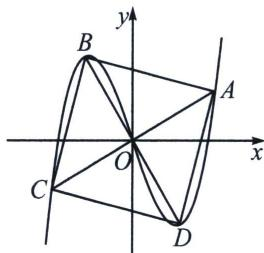

> [!faq]- 《导数专题(上册)》例题解析
>
> > [!success]- **【答案】** C
>
> > [!note]- **【解析】**
> > 解析 法一：因为四边形 $ABCD$ 为正方形， $O$ 为其中心，所以 $AC \perp BD$ 于点 $O$ ，且 $OA = OB = OC = OD$ ，不妨设直线 $AC$ 的方程为 $y = kx (k > 0)$ ，则直线 $BD$ 的方程为 $y = -\frac{1}{k} x$ ，设点 $A(x_1, y_1)$ ，
> >
> > $B(x_{2}, y_{2})$ ，则 $C(-x_{1}, -y_{1})$ ， $D(-x_{2}, -y_{2})$ ，当 $b \geqslant 0$ 时， $f'(x) = 3x^{2} + b \geqslant 0$ ， $f(x)$ 在 R 上单调递增，与 $y = -\frac{1}{k}x$ 仅有 1 个交点为原点，不合题意，当 b < 0 时，联立直线 AC 与曲线方程，得到 $x_{1}^{3} + bx_{1} = kx_{1}$ ，解得 $x_{1}^{2} = k - b$ ，联立直线 BD 与曲线方程，得到 $x_{2}^{3} + bx_{2} = -\frac{1}{k}x_{2}$ ，解得 $x_{2}^{2} = -\frac{1}{k} - b$ ，因为 OA = OB，所以 $(1 + k^{2})(k - b) = \left(1 + \frac{1}{k^{2}}\right)\left(-\frac{1}{k} - b\right)$ ，整理得 $(k^{2} + \frac{1}{k^{2}}) - b(k - \frac{1}{k}) = 0$ ，即 $\left(k - \frac{1}{k}\right)^{2} - b\left(k - \frac{1}{k}\right) + 2 = 0$ ，设 $t(k) = k - \frac{1}{k}(k > 0)$ ，该函数在 $(0, +\infty)$ 上单调递增，值域为 R，要使符合题意的正方形只有 1 个，则必有 $t^{2} - bt + 2 = 0$ 有两个相等的实数根，即 $\triangle = b^{2} - 8 = 0$ ，解得 $b = -2\sqrt{2}$ ，正根舍去，此时 $k - \frac{1}{k} = -2\sqrt{2}$ ，解得 $k = \frac{\sqrt{6} - \sqrt{2}}{2}$ ，负根舍去，所以 $b = -2\sqrt{2}$ ；
> > 法二：不妨设点 A 在第一象限，且 A, B, C, D 四点逆时针排布，设 $\angle A O x = \theta, 0 < \theta < \frac{\pi}{2}$ ， $|OA| = |OB| = |OC| = |OD| = r$ ，则 $A(r\cos\theta, r\sin\theta)$ ， $B(r\cos(\theta + \frac{\pi}{2}), r\sin(\theta + \frac{\pi}{2})) = (-r\sin\theta, r\cos\theta)$ ，
> >
> > 
> >
> > 由题意得两点存在曲线 $f(x)=x^{3}+bx$ 上，所以 $\left\{\begin{aligned}r\sin\theta &= r^{3}\cos^{3}\theta + br\cos\theta① \\ r\cos\theta &= -r^{3}\sin^{3}\theta - br\sin\theta②\end{aligned}\right.$ ，由①得 $r^{2}=\frac{\sin\theta-b\cos\theta}{\cos^{3}\theta}$ ，由②得 $r^{2}=-\frac{\cos\theta+b\sin\theta}{\sin^{3}\theta}$ ，联立两式得 $b=\frac{\sin^{4}\theta+\cos^{4}\theta}{\sin^{3}\theta\cos\theta-\sin\theta\cos^{3}\theta}=\frac{1+\tan^{4}\theta}{\tan^{3}\theta-\tan\theta}=-\frac{2\tan\theta}{1-\tan^{2}\theta}\cdot\frac{1+\tan^{4}\theta}{2\tan^{2}\theta}=-\tan2\theta\cdot\frac{(1-\tan^{2}\theta)^{2}+2\tan^{2}\theta}{2\tan^{2}\theta}=-\tan2\theta\left[2\left(\frac{1-\tan^{2}\theta}{2\tan\theta}\right)^{2}+\frac{2\tan^{2}\theta}{2\tan^{2}\theta}\right]=-\tan2\theta\left[2\left(\frac{1-\tan^{2}\theta}{2\tan\theta}\right)^{2}+\frac{2\tan^{2}\theta}{2\tan^{2}\theta}\right]=-\tan2\theta\left[2\left(\frac{1-\tan^{2}\theta}{2\tan\theta}\right)^{2}+\tan2\theta\right]=-\left(\frac{2}{\tan2\theta}+\tan2\theta\right)$ ，因为 $r^{2}=\frac{\sin\theta-b\cos\theta}{\cos^{3}\theta}>0,\quad r^{2}=-\frac{\cos\theta+b\sin\theta}{\sin^{3}\theta}>0$ ，故 $\sin\theta-b\cos\theta>0,\quad \cos\theta+b\sin\theta<0$ ，又 $\sin\theta>0,\quad \cos\theta>0$ ，所以只有 b<0 时，才能使得两式恒成立，故 $\tan2\theta>0$ ，由基本不等式可得 $b=-\left(\frac{2}{\tan2\theta}+\tan2\theta\right)\leqslant-2\sqrt{\frac{2}{\tan2\theta}\cdot\tan2\theta}=-2\sqrt{2}$ ，当且仅当 $\frac{2}{\tan2\theta}=$ $\tan2\theta$ ，即 $\tan2\theta=\sqrt{2}$ 时，等号成立，由题意， $\theta$ 有唯一解，故 $b=-2\sqrt{2}$ 。
> >
> > 故选 **C**.
