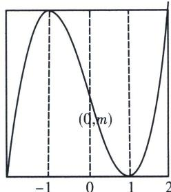
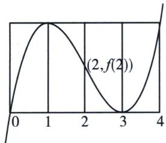
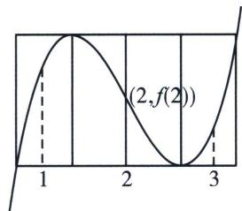
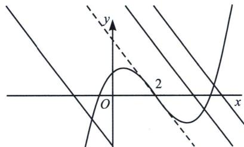

> [!faq]- 《导数专题(上册)》例题解析
>
> > [!success]- **【答案】** C
>
> > [!note]- **【解析】**
> > 解析 由 $f'(x)=3x^{2}-3=3(x+1)(x-1)$ ，得 $x=\pm1$ ，画出函数四段论图象
> >
> > 因为函数的定义域为[0, 2]，所以 $f(x)_{\min} = f(1) = m - 2$ ， $f(x)_{\max} = f(2) = m + 2$ ， $f(0) = m$ 由题意知 $f(1) + f(1) > f(2)$ ，即 $-4 + 2m > 2 + m$ ，得到 $m > 6$ ，故选C.
> >
> > 
> >
> > (2024 广东省名校高三开学考多选 T12) 设函数 $f(x) = ax^3 + bx^2 + cx + d (a \neq 0)$ 满足 $f(1) +$ $f(3) = 2f(2)$ ，则给出如下结论正确的是（）A. $f(x)$ 关于点 $(2, f(2))$ 成中心对称B. 若 $f(x)$ 在 $(0, 1)$ 上单调递增，则 $f(x)$ 是在 $(3, 4)$ 上单调递增C. 若 $a \cdot f(1) \geqslant a \cdot f(3)$ ，则 $f(x)$ 无极值D. 对任意实数 $x_0$ ，直线 $y = (c - 12a)(x - x_0) + f(x_0)$ 与曲线 $y = f(x)$ 有唯一公共点
> >
> > 
> >
> > 解析 根据 $f(1)+f(3)=2f(2)$ ，我们将极大值设为 $f(1)$ ，极小值 $f(3)$ ，四段论作图左，易知A，B都正确，如下右图，若 $a\cdot f(1)\geqslant a\cdot f(3)$ ，根据对称性，发现 $f(x)$ 有极值，C不正确；
> >
> > 
> >
> > 
> >
> > 
> >
> > 关于 D，依题意， $-\frac{b}{3a}=2$ ，整理得：b=-6a，则 $f(x)=ax^{3}-6ax^{2}+cx+d$ ， $f'(x)=3ax^{2}-12ax+c$ ， $f'(2)=c-12a$ ，故过拐点 $(2,f(2))$ 的切线斜率为 c-12a，则直线 $y=(c-12a)(x-x_{0})+f(x_{0})$ 是过曲线上任意一点作拐点切线平行的直线，如右图，则根据几何性质可知与 $y=f(x)$ 只有一个交点。D 正确。故选 ABD。
> >
> > 注意: 关于拐点, 任何函数有拐点, 通常过拐点的切线与原函数只有一个交点, 三次函数中,除了大于极大值或者小于极小值的与 $x$ 轴平行的直线与三次函数有一个交点, 还有与拐点切线平行的直线与三次函数只有一个交点.
> >
> > 三次函数四段论除了用于解决单调性和恒成立，也能帮助我们找零点，我们来看一下以下高考题.
