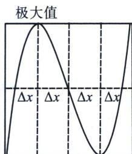
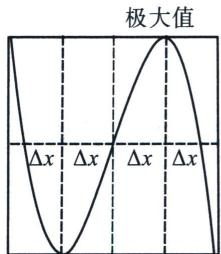

<!-- question-source:start -->
例18 (2021·乙卷)已知函数 $f(x)=x^{3}-x^{2}+ax+1$ .

(1) 讨论 $f(x)$ 的单调性；

(2)求曲线 $y=f(x)$ 过坐标原点的切线与曲线 $y=f(x)$ 的公共点的坐标.

(1) $f'(x)=3x^{2}-2x+a,\quad\Delta=4-12a$ ，①当 $\Delta\leqslant0$ ，即 $a\geqslant\frac{1}{3}$ 时，由于 $f'(x)$ 的图象是开口向上的抛物线，故此时 $f'(x)\geqslant0$ ，则 $f(x)$ 在R上单调递增；

②当 $\Delta > 0$ ，即 $a < \frac{1}{3}$ 时，令 $f'(x) = 0$ ，解得 $x_1 = \frac{1 - \sqrt{1 - 3a}}{3}$ ， $x_2 = \frac{1 + \sqrt{1 - 3a}}{3}$ ，令 $f'(x) > 0$ ，解得 $x < x_1$ 或 $x > x_2$ ，令 $f'(x) < 0$ ，解得 $x_1 < x < x_2$ ，所以 $f(x)$ 在 $(- \infty, x_1)$ ， $(x_2, + \infty)$ 单调递增，在 $(x_1, x_2)$ 单调递减；

综上，当 $a \geqslant \frac{1}{3}$ 时， $f(x)$ 在 $\mathbf{R}$ 上单调递增；当 $a < \frac{1}{3}$ 时， $f(x)$ 在 $\left(-\infty, \frac{1 - \sqrt{1 - 3a}}{3}\right)$ ， $\left(\frac{1 + \sqrt{1 - 3a}}{3}, +\infty\right)$ 单调递增，在 $\left(\frac{1 - \sqrt{1 - 3a}}{3}, \frac{1 + \sqrt{1 - 3a}}{3}\right)$ 单调递减.

(2)设曲线 $y=f(x)$ 过坐标原点的切线为 l，则切点为 $(x_{0}, x_{0}^{3}-x_{0}^{2}+ax_{0}+1)$ ， $f'(x_{0})=3x_{0}^{2}-2x_{0}+a$ ，则切线方程为 $y-(x_{0}^{3}-x_{0}^{2}+ax_{0}+1)=(3x_{0}^{2}-2x_{0}+a)(x-x_{0})$ ，将原点代入切线方程有， $2x_{0}^{3}-x_{0}^{2}-1=0$ ，解得 $x_{0}=1$ ，所以切线方程为 $y=(a+1)x$ ，令 $x^{3}-x^{2}+ax+1=(a+1)x$ ，即 $x^{3}-x^{2}-x+1=0$ ，解得 x=1 或 x=-1，所以曲线 $y=f(x)$ 过坐标原点的切线与曲线 $y=f(x)$ 的公共点的坐标为 $(1, a+1)$ 和 $(-1, -a-1)$ .

## 二、三次函数四段论

$f(x) = ax^{3} + bx^{2} + cx + d(a > 0)$ 且导函数 $\Delta >0 f(x) = ax^3 +bx^2 +cx + d(a <   0)$ 且导函数 $\Delta >0$

  
极小值等值点 中心 极小值

  
极小值 中心 极小值等值点
<!-- question-source:end -->

![[高中/总复习/专题/2026版高中《mst老唐说题》导数专题（数学）/上册/第01章_技能篇_导数基本技能/第四节_三次函数的基本理论/例题/answers/Q00046360A1.md]]
