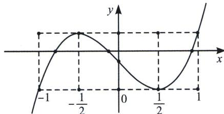

<!-- question-source:start -->
例23 (2020·新课标ⅢT20)设函数 $f(x)=x^{3}+bx+c$ ，曲线 $y=f(x)$ 在点 $\left(\frac{1}{2},f\left(\frac{1}{2}\right)\right)$ 处的切线与y轴垂直.

(1) 求 b;

(2)若 $f(x)$ 有一个绝对值不大于1的零点，证明： $f(x)$ 所有零点的绝对值都不大于1.

(1) 由 $f(x) = x^3 + bx + c$ ，得 $f'(x) = 3x^2 + b$ ，所以 $f'\left(\frac{1}{2}\right) = 3 \times \left(\frac{1}{2}\right)^2 + b = 0$ ，即 $b = -\frac{3}{4}$ ;

(2)证明：由
(1)可得， $f(x)=x^{3}-\frac{3}{4}x+c$ 。 $f'(x)=3x^{2}-\frac{3}{4}=3\left(x+\frac{1}{2}\right)\left(x-\frac{1}{2}\right)$ ，可得当 $x\in\left(-\infty,-\frac{1}{2}\right),\left(\frac{1}{2},+\infty\right)$ 时， $f'(x)>0$ ，当 $x\in\left(-\frac{1}{2},\frac{1}{2}\right)$ 时， $f'(x)<0$ ，则 $f(x)$ 在 $\left(-\infty,-\frac{1}{2}\right),\left(\frac{1}{2},+\infty\right)$ 上单调递增，在 $\left(-\frac{1}{2},\frac{1}{2}\right)$ 上单调递减， $f(x)_{\text{极小值}}=f\left(\frac{1}{2}\right)$ ， $f(x)_{\text{极大值}}=f\left(-\frac{1}{2}\right)$ 。且 $f(-1)=f\left(\frac{1}{2}\right)=c-\frac{1}{4}$ ， $f\left(-\frac{1}{2}\right)=f (1)=c+\frac{1}{4}$ ，若 $f(x)$ 的所有零点中存在一个绝对值不大于1的零点 $x_{0}$ ，则 $f(-1)\leqslant0$ 且 $f (1)\geqslant0$ ，如图，即 $-\frac{1}{4}\leqslant c\leqslant\frac{1}{4}$ 。

①当 $-\frac{1}{4} < c < \frac{1}{4}$ 时， $f(-1) = f\left(\frac{1}{2}\right) < 0$ ， $f\left(-\frac{1}{2}\right) = f
(1) > 0$ ；故 $\exists x_1 \in \left(-1, -\frac{1}{2}\right)$ ，使得 $f(x_1) = 0$ ； $\exists x_2 \in \left(-\frac{1}{2}, \frac{1}{2}\right)$ ，使得 $f(x_2) = 0$ ； $\exists x_3 \in \left(\frac{1}{2}, 1\right)$ ，使得 $f(x_3) = 0$ ，即 $f(x)$ 所有零点的绝对值都小于 1；

②当 $c=\frac{1}{4}$ 时，有且仅有 $f(-1)=f\left(\frac{1}{2}\right)=0;$

③当 $c = -\frac{1}{4}$ 时，有且仅有 $f\left(-\frac{1}{2}\right) = f
(1) = 0$ ;

综上， $f(x)$ 所有零点的绝对值都不大于1.
<!-- question-source:end -->

![[高中/总复习/专题/2026版高中《mst老唐说题》导数专题（数学）/上册/第01章_技能篇_导数基本技能/第四节_三次函数的基本理论/例题/answers/Q00046366A1.md]]
