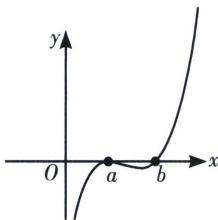
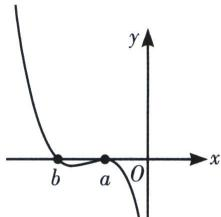

> [!faq]- 《导数专题(上)》例题解析
>
> > [!success]- **【答案】** D
>
> > [!note]- **【分析】**
> > 本题未单列分析。
>
> > [!note]- **【解析】**
> > 解析 令 $f(x)=0$ ，解得 x=a 或 x=b，即 x=a 及 x=b 是 $f(x)$ 的两个零点，当 a>0 时，由三次函数的性质可知，要使 x=a 是 $f(x)$ 的极大值点，则函数 $f(x)$ 的大致图象如下左图所示，则 0<a<b；当 a<0 时，由三次函数的性质可知，要使 x=a 是 $f(x)$ 的极大值点，则函数 $f(x)$ 的大致图象如下右图所示，则 b<a<0；综上， $ab>a^{2}$ 。故选 D.
> > 
> > 
