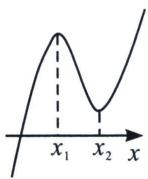
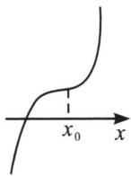
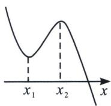
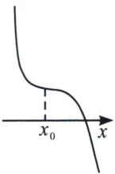
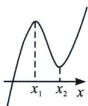
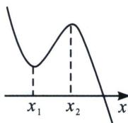
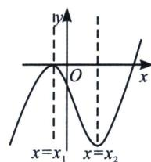
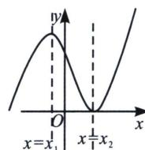

## 第四节 三次函数的基本理论

## 一、三次函数的极值与拐点

设三次函数为 $f(x)=ax^{3}+bx^{2}+cx+d(a、b、c、d\in\mathbb{R}$ 且 $a\neq0$ ，其基本性质有：

性质一：定义域为 $\mathbf{R}$

性质二：值域为 $\mathbf{R}$ ，函数在整个定义域上没有最大值、最小值.

性质三：单调性和图象

三次函数导函数为二次函数 $f'(x)=3ax^{2}+2bx+c,\quad\Delta=4b^{2}-12ac=4(b^{2}-3ac)$

<table><tr><td></td><td colspan="2">a&gt;0</td><td colspan="2">a&lt;0</td></tr><tr><td rowspan="3">图象</td><td>Δ&gt;0</td><td>Δ≤0</td><td>Δ&gt;0</td><td>Δ≤0</td></tr><tr><td></td><td></td><td></td><td></td></tr><tr><td>图1</td><td>图2</td><td>图3</td><td>图4</td></tr></table>

当 $a > 0$ 时，

①当 $\Delta=4b^{2}-12ac=4(b^{2}-3ac)>0$ ，即 $b^{2}-3ac>0$ 时， $f'(x)$ 与 x 轴有两个交点 $x_{1}$ ， $x_{2}$ ， $f(x)$ 形成三个单点区间和两个极值点 $x_{1}$ ， $x_{2}$ ，图象如图 1.

②当 $\Delta=4b^{2}-12ac=4(b^{2}-3ac)\leqslant0$ ，即 $b^{2}-3ac\leqslant0$ 时， $f'(x)$ 与 x 轴没有穿越零点， $f(x)$ 没有极值点，图象如图 2.

当 $a < 0$ 时，

①当 $\Delta=4b^{2}-12ac=4(b^{2}-3ac)>0$ ，即 $b^{2}-3ac>0$ 时， $f'(x)$ 与 x 轴有两个交点 $x_{1}$ ， $x_{2}$ ， $f(x)$ 形成三个单点区间和两个极值点 $x_{1}$ ， $x_{2}$ 。图象如图 3

②当 $\Delta=4b^{2}-12ac=4(b^{2}-3ac)\leqslant0$ ，即 $b^{2}-3ac\leqslant0$ 时， $f'(x)$ 与 x 轴没有穿越零点， $f(x)$ 没有极值点，图象如图 4.

性质四：奇偶性

对于三次函数 $f(x)=ax^{3}+bx^{2}+cx+d(a,b,c,d\in\mathbf{R}$ 且 $a\neq0)$ .

① $f(x)$ 不可能为偶函数；②当且仅当b=d=0时是奇函数.

性质五：对称性

①三次函数是中心对称曲线，且对称中心是 $\left(-\frac{b}{3a},f\left(-\frac{b}{3a}\right)\right)$ ;

②其导函数为 $f'(x)=3ax^{2}+2bx+c=0$ 对称轴为 $x=-\frac{b}{3a}$ ，所以对称中心的横坐标也就是导函数的对称轴，可见， $y=f(x)$ 图象的对称中心在导函数 $y=f'(x)$ 的对称轴上，且又是两个极值点的中点，同时也是二阶导为零的点；我们可以得出若 $y=f(x)$ 是可导函数，若 $y=f(x)$ 的图象关于点 $(m,n)$ 对称，则 $y=f'(x)$ 图象关于直线x=m对称；同理，若 $y=f(x)$ 图象关于直线x=m对称，则 $y=f'(x)$ 图象关于点 $(m,0)$ 对称。故奇函数的导数是偶函数，偶函数的导数是奇函数，周期函数的导数还是周期函数。

性质五：三次方程 $f(x)=0$ 的实根个数

对于三次函数 $f(x)=ax^{3}+bx^{2}+cx+d(a、b、c、d\in\mathbb{R}$ 且 $a\neq0$ ，其导数为 $f'(x)=3ax^{2}+2bx+c$ ，当 $b^{2}-3ac>0$ ，其导数 $f'(x)=0$ 有两个解 $x_{1}$ ， $x_{2}$ ，原方程有两个极值 $x_{1},x_{2}=\frac{-b\pm\sqrt{b^{2}-3ac}}{3a}$ .
①当 $f(x_{1})\cdot f(x_{2})>0$ ，原方程有且只有一个实根，图象如图5，6.

②当 $f(x_{1})\cdot f(x_{2})=0$ ，则方程有2个实根，图象如图7，8.

③当 $f(x_{1})\cdot f(x_{2})<0$ ，则方程有三个实根.

  
图5

  
图6

  
图 7

  
图8

![[高中/总复习/专题/2026版高中《mst老唐说题》导数专题（数学）/上册/第01章_技能篇_导数基本技能/第四节_三次函数的基本理论/例题/Q00046356.md]]
![[高中/总复习/专题/2026版高中《mst老唐说题》导数专题（数学）/上册/第01章_技能篇_导数基本技能/第四节_三次函数的基本理论/例题/Q00046357.md]]
![[高中/总复习/专题/2026版高中《mst老唐说题》导数专题（数学）/上册/第01章_技能篇_导数基本技能/第四节_三次函数的基本理论/例题/Q00046358.md]]
![[高中/总复习/专题/2026版高中《mst老唐说题》导数专题（数学）/上册/第01章_技能篇_导数基本技能/第四节_三次函数的基本理论/例题/Q00046359.md]]
![[高中/总复习/专题/2026版高中《mst老唐说题》导数专题（数学）/上册/第01章_技能篇_导数基本技能/第四节_三次函数的基本理论/例题/Q00046360.md]]
![[高中/总复习/专题/2026版高中《mst老唐说题》导数专题（数学）/上册/第01章_技能篇_导数基本技能/第四节_三次函数的基本理论/对点训练/Q00046361.md]]
![[高中/总复习/专题/2026版高中《mst老唐说题》导数专题（数学）/上册/第01章_技能篇_导数基本技能/第四节_三次函数的基本理论/对点训练/Q00046362.md]]
![[高中/总复习/专题/2026版高中《mst老唐说题》导数专题（数学）/上册/第01章_技能篇_导数基本技能/第四节_三次函数的基本理论/例题/Q00046363.md]]
![[高中/总复习/专题/2026版高中《mst老唐说题》导数专题（数学）/上册/第01章_技能篇_导数基本技能/第四节_三次函数的基本理论/例题/Q00046364.md]]
![[高中/总复习/专题/2026版高中《mst老唐说题》导数专题（数学）/上册/第01章_技能篇_导数基本技能/第四节_三次函数的基本理论/例题/Q00046365.md]]
![[高中/总复习/专题/2026版高中《mst老唐说题》导数专题（数学）/上册/第01章_技能篇_导数基本技能/第四节_三次函数的基本理论/例题/Q00046366.md]]
![[高中/总复习/专题/2026版高中《mst老唐说题》导数专题（数学）/上册/第01章_技能篇_导数基本技能/第四节_三次函数的基本理论/例题/Q00046367.md]]
