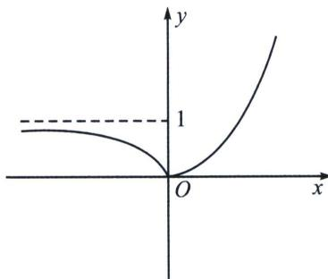

> [!faq]- 《导数专题(上册)》例题解析
>
> > [!success]- **【答案】** ACD
>
> > [!note]- **【分析】**
> > 本题未单列分析。
>
> > [!note]- **【解析】**
> > 解析 由极值点定义，结合图像如图，A 正确；
> > 若函数 $g(x)=f(x)-a$ 有且只有一个零点，则实数a的取值范围是 $\{0\}\cup\{1,+\infty\}$ ，故B错误；
> > 对于 C. 由 $f(x) = |e^x - 1| = \begin{cases} 1 - e^x, & x < 0 \\ e^x - 1, & x \geqslant 0 \end{cases}$ ，可得 $f'(x) = \begin{cases} -e^x, & x < 0, \\ e^x, & x \geqslant 0, \end{cases}$
> > 所以点 $A(x_{1}, 1 - e^{x_{1}})$ 和点 $B(x_{2}, e^{x_{2}} - 1)$ ， $k_{AM} = -e^{x_{1}}$ ， $k_{BN} = e^{x_{2}}$ ，因为函数 $f(x)$ 的图象在点 $A(x_{1}, f(x_{1}))$ 和点 $B(x_{2}, f(x_{2}))$ 处的两条切线互相垂直，所以 $-e^{x_{1}} \cdot e^{x_{2}} = -1$ ，所以 $e^{x_{1} + x_{2}} = 1$ ，所以 $x_{1} + x_{2} = 0$ ，故 C 正确；
> > 对于D. 直线 $AM$ 的方程为 $y - 1 + e^{x_1} = -e^{x_1}(x - x_1)$ ， $M(0, e^{x_1}x_1 - e^{x_1} + 1)$ ，所以 $|AM| = \sqrt{x_1^2 + (e^{x_1}x_1)^2} = \sqrt{1 + e^{2x_1}} \cdot |x_1|$ ，同理 $|BN| = \sqrt{1 + e^{2x_2}} \cdot |x_2|$ ，所以 $\frac{|AM|}{|BN|} = \frac{\sqrt{1 + e^{2x_1}} |x_1|}{\sqrt{1 + e^{2x_2}} |x_2|} = \frac{\sqrt{1 + e^{2x_1}}}{\sqrt{1 + e^{-2x_1}}} = e^{x_1} \in (0, 1)$ ，因此D正确。故选ACD.
> > 
