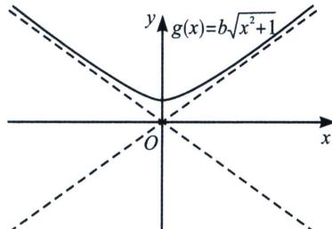

> [!faq]- 《导数专题(上册)》例题解析
>
> > [!success]- **【答案】** ABC
>
> > [!note]- **【分析】**
> > 本题未单列分析。
>
> > [!note]- **【解析】**
> > 解析 本着小题小做的思想，本题我们需要数形结合来简化处理，我们先对 $g(x)=b\sqrt{x^{2}+1}$ 处理一下，由 $y=b\sqrt{x^{2}+1}$ ， $\frac{y^{2}}{b^{2}}-x^{2}=1$ ，故当b>0时，是双曲线的上支，b<0时，是双曲线下支，b=0时是x轴；无论如何 $y=\pm bx$ 是其渐近线，而 $f(x)=e^{x}-ax$ 当 $x\rightarrow+\infty$ ， $f(x)\rightarrow+\infty$ ，且 $e^{x}-ax-bx\rightarrow+\infty$ ，故D错误；
> > 
> > 对于 A， $f'(x)=e^{x}-a>-a$ ，当 $g'(x)=0$ 时，切线斜率一定介于两渐近线之间， $g'(x)\in(-|b|, |b|)$ ，所以对于任意的实数 a，存在 b，使得 $f(x)$ 与 $g(x)$ 有互相平行的切线，所以 A 正确；
> > 对于B，由于给定的实数 $x_0$ ，由 $g(x_0)\geqslant f(x_0)$ ，只需 $e^{x_0}\leqslant b\sqrt{x_0^2 + 1} +ax_0$ 则只要 $b$ 足够大， $|ax_0|$ 按照需求调整，就能满足，所以B正确；
> > 对于 C，我们做一下探路， $y=f(x)-g(x)$ 在 $[0,+\infty)$ 上的最小值为 0，则两函数有公切点，对函数做一下变形得 $e^{x}\geqslant ax+b\sqrt{x^{2}+1}$ ，易知 $x=\frac{1}{2}$ 时， $e^{\frac{1}{2}}\geqslant\frac{a}{2}+\frac{\sqrt{5}}{2}b\Rightarrow2\sqrt{e}\geqslant a+\sqrt{5}b$ ， $F(x)=f(x)-g(x)\geqslant0$ 恒成立，且 $F(x)\geqslant F\left(\frac{1}{2}\right)=0$ ，符合费马引理（极点效应），所以 C 正确；
> >
> > 故选 **ABC**.
