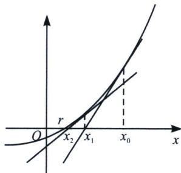

<!-- question-source:start -->
例14 (2025 贵阳一中高三月考 T14) 牛顿在《流数法》一书中, 给出了高次代数方程的一种数值解法一一牛顿法. 如图, $r$ 是函数 $f(x)$ 的零点, 牛顿用“作切线”的方法找到了一串逐步逼近 $r$ 的实数 $x_0$ , $x_1$ , $\cdots$ , $x_{n-1}$ , $x_n$ , 在横坐标为 $x_0$ 的点处作 $f(x)$ 的切线, 则 $f(x)$ 在 $x=x_0$ 处的切线与 $x$ 轴交点的横坐标是 $x_1$ , 同理 $f(x)$ 在 $x=x_1$ 处的切线与 $x$ 轴交点的横坐标是 $x_2$ , $\cdots$ , 一直继续下去, 得到数列 $\{x_n\}$ . 令 $f(x)=(x-1)^3$ . 当 $x_0=2$ 时, 用牛顿法可求出方程 $f(x)=0$ 的近似解 $x_1=$ \_\_\_\_; 当 $x_0=2$ , 且 $x_n>1(n\in\mathbb{N}^*)$ 时, 数列 $\{x_n\}$ 的通项公式为 \_\_\_\_.

(2) = 1$ ，且 $f'(x) = 3(x - 1)^2$ ，则 $f' (2) = 3$ ，所以曲线 $y = f(x)$ 在 $x = x_0$ 处的切线方程为 $y - 1 = 3(x - 2)$ ，故令 $y = 0 \Rightarrow x_1 = \frac{5}{3}$ ；故函数在 $x = x_n$ 处切线为 $y - f(x_n) = f'(x_n)(x - x_n)$ ，即 $x_{n+1} = x_n - \frac{f(x_n)}{f'(x_n)} = x_n - \frac{(x_n - 1)^3}{3(x_n - 1)^2} = \frac{2}{3} x_n + \frac{1}{3}$ ，即 $x_{n+1} - 1 = \frac{2}{3}(x_n - 1)$ ，故 $x_n = \left(\frac{2}{3}\right)^n + 1$
<!-- question-source:end -->

![[高中/总复习/专题/2026版高中《mst老唐说题》导数专题（数学）/上册/第02章_技能篇_导数的切线方程/第一节_基本切线方程/三_牛顿__拉夫逊方法的应用/例题/answers/Q00047044A1.md]]
