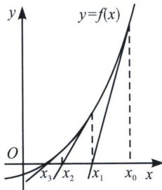

<!-- question-source:start -->
例15 (2023 东北三省四市教研联合体·多选 T12)人们很早以前就开始探索高次方程的数值求解问题。牛顿在《流数法》一书中给出了牛顿迭代法：用“作切线”的方法求方程的近似解。具体步骤如下：设 $r$ 是函数 $y = f(x)$ 的一个零点，任意选取 $x_0$ 作为 $r$ 的初始近似值，曲线 $y = f(x)$ 在点 $(x_0, f(x_0))$ 处的切线为 $l_1$ ，设 $l_1$ 与 $x$ 轴交点的横坐标为 $x_1$ ，并称 $x_1$ 为 $r$ 的 1 次近似值；曲线 $y = f(x)$ 在点 $(x_1, f(x_1))$ 处的切线为 $l_2$ ，设 $l_2$ 与 $x$ 轴交点的横坐标为 $x_2$ ，称 $x_2$ 为 $r$ 的 2 次近似值。一般地，曲线 $y = f(x)$ 在点 $(x_n, f(x_n))(n \in \mathbf{N}_+)$ 处的切线为 $l_{n+1}$ ，记 $l_{n+1}$ 与 $x$ 轴交点的横坐标为 $x_{n+1}$ ，并称 $x_{n+1}$ 为 $r$ 的 $n+1$ 次近似值。在一定精确度下，用四舍五入法取值，当 $x_n$ 与 $x_{n+1}$ 的近似值相等时，该近似值即作为函数 $f(x)$ 的一个零点 $r$ 的近似值。下列说法正确的是

A. $x_{n+1} = x_n + \frac{f(x_n)}{f'(x_n)} (f'(x_n) \neq 0)$ B. 利用牛顿迭代法求函数 $f(x) = x^3 - 6$ 的零点 $r$ 的近似值（精确到 0.1），取 $x_0 = 2$ ，需要作两条切线即可确定 $r$ 的近似值
C. 利用二分法求函数 $f(x) = x^3 - 6$ 的零点 $r$ 的近似值（精确度为 0.1），给定初始区间为 (1, 2)，需进行 4 次区间二分可得到零点 $r$ 的近似值
D. 利用牛顿迭代法求函数 $f(x) = \ln x + 2x - b (b > 2)$ 的零点 $r$ 的近似值，任取 $x_0 \in (1, r)$ ，总有 $x_n < x_{n+1} < r$

$$
y = f (x)
$$

$$
\left(x _ {n}, f \left(x _ {n}\right)\right)
$$

$$
y - f \left(x _ {n}\right) = f ^ {\prime} \left(x _ {n}\right) \left(x - x _ {n}\right)
$$

$$
y = 0
$$

$$
x = x _ {n} - \frac {f (x _ {n})}{f ^ {\prime} (x _ {n})}
$$

$$
x _ {n + 1} = x _ {n} - \frac {f (x _ {n})}{f ^ {\prime} (x _ {n})} \left(f ^ {\prime} (x _ {n}) \neq 0\right)
$$

$$
x _ {0} = 2, f (x) = x ^ {3} - 6, f ^ {\prime} (x) = 3 x ^ {2}
$$

$$
x _ {1} = x _ {0} - \frac {f (x _ {0})}{f ^ {\prime} (x _ {0})} = 2 - \frac {2}{3 \times 4} = \frac {1 1}{6}, x _ {2} = x _ {1} - \frac {f (x _ {1})}{f ^ {\prime} (x _ {1})} =
$$

$$
\frac {1 1}{6} - \frac {\left(\frac {1 1}{6}\right) ^ {3} - 6}{3 \times \left(\frac {1 1}{6}\right) ^ {2}} = \frac {1 9 7 9}{1 0 8 9} \approx 1
$$

$$
x _ {1} = \frac {1 1}{6} \approx 1
$$

$$
1. 8 3 - 1. 8 2 = 0. 1
$$

求两次切线即可求解近似值，B 正确；

对于 C, $f
(1) = -5 < 0$ , $f
(2) = 2 > 0$ , $f\left(\frac{3}{2}\right) = \frac{27}{8} - 6 < 0$ , 故第一次确定零点位于 $\left(\frac{3}{2}, 2\right)$ , $f\left(\frac{7}{4}\right) = \frac{343}{64} - 6 = \frac{343}{64} - \frac{384}{64} < 0$ , 故第二次确定零点位于 $\left(\frac{7}{4}, 2\right)$ , $f\left(\frac{15}{8}\right) = \frac{3375}{512} - 6 = \frac{3375}{512} - \frac{3072}{512} > 0$ , 故第三次确定零点位于 $\left(\frac{7}{4}, \frac{15}{8}\right)$ , 此时 $\frac{15}{8} - \frac{7}{4} = \frac{1}{8} = 0.125$ , 第四次分区间时, 区间长度为 $\frac{1}{2} \times \frac{1}{8} < 0.1$ , 此时一定可以确定近似值所在区间, 故 C 正确; 对于 D, $f(x) = \ln x + 2x - b (b > 2)$ , 则 $f'(x) = \frac{1}{x} + 2$ , 所以对任意的 $x_n \in (0, +\infty)$ , 曲线 $f(x)$ 在 $(x_n, f(x_n))$ 处的切线方程为: $y = \frac{1 + 2x_n}{x_n} x + \ln x_n - b - 1$ , 故令 $h(x) = \frac{1 + 2x_n}{x_n} x + \ln x_n - b - 1$ , 令 $F(x) = f(x) - h(x) = \ln x - \frac{1}{x_n} x - \ln x_n + 1$ , 所以 $F'(x) = \frac{1}{x} - \frac{1}{x_n} = \frac{x_n - x}{x_n x}$ , 当 $x \in (0, x_n)$ 时, $F'(x) > 0$ , $F(x)$ 单调递增, 当 $x \in (x_n, +\infty)$ 时, $F'(x) < 0$ , $F(x)$ 单调递减, 所以, 恒有 $F(x) \leqslant F(x_n) = 0$ , 即 $f(x) \leqslant h(x)$ 恒成立, 当且仅当 $x = x_n$ 时等号成立, 另一方面, $x_{n+1} = x_n - \frac{f(x_n)}{f'(x_n)}$ , 且当 $x_n \neq a$ 时, $x_{n+1} \neq x_n$ , (若 $x_n = r$ , 则 $f(x_n) = f(r) = 0$ , 故任意 $x_{n+1} = x_n = \cdots = x_1 = r$ , 显然矛盾), 因为 $x_{n+1}$ 是 $h(x)$ 的零点, 所以 $f(x_{n+1}) < h(x_{n+1}) = f(r) = 0$ , 因为 $f(x)$ 为单调递增函数, 所以, 对任意的 $x_n \neq r$ 时, 总有 $x_{n+1} < r$ , 又因为 $x_0 < r$ , 所以, 对于任意 $n \in \mathbb{N}^*$ , 均有 $x_n < r$ , 所以, $f'(x_n) > 0$ , $f(x_n) < f(r) < 0$ , 所以 $x_{n+1} = x_n - \frac{f(x_n)}{f'(x_n)} > x_n$ , 综上, 当 $x_0 \in (1, r)$ , 总有 $x_n < x_{n+1} < r$ . 故 D 正确. 故选 BCD.
<!-- question-source:end -->
