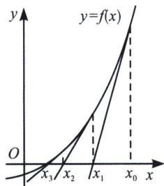

<!-- question-source:start -->
例17 (2025 惠东县高二期中 T19) 牛顿在《流数法》一书中给出了“牛顿切线法”求方程的近似解。具体步骤如下：设 $r$ 是函数 $y = f(x)$ 的一个零点，任意选取 $x_0$ 作为 $r$ 的初始近似值，曲线 $y = f(x)$ 在点 $(x_0, f(x_0))$ 处的切线为 $l_1$ ，设 $l_1$ 与 $x$ 轴交点的横坐标为 $x_1$ ，并称 $x_1$ 为 $r$ 的 1 次近似值；曲线 $y = f(x)$ 在点 $(x_1, f(x_1))$ 处的切线为 $l_2$ ，设 $l_2$ 与 $x$ 轴交点的横坐标为 $x_2$ ，称 $x_2$ 为 $r$ 的 2 次近似值。一般地， $y = f(x)$ 在点 $(x_n, f(x_n))(n \in \mathbb{N})$ 处的切线为 $l_{n+1}$ ，记 $l_{n+1}$ 与 $x$ 轴交点的横坐标为 $x_{n+1}$ ，并称 $x_{n+1}$ 为 $r$ 的 $n+1$ 次近似值。重复以上操作，在一定精确度下，可取 $x_n$ 为 $f(x) = 0$ 的近似解。求函数 $f(x) = x^2 - 2$ 的大于零的零点 $r$ 的近似值，取 $x_0 = 2$ 。

(1)求 $x_{1}$ 和 $x_{2}$ ;

(2)求 $x_{n}$ 和 $x_{n-1}$ 的关系并证明 $(n \in \mathbf{N}^{*})$ ;

(3) 证明： $\sqrt{2}n<\sum_{i=1}^{n}x_{i}<\sqrt{2}n+1(n\in\mathbf{N}^{*})$ .

<!-- question-source:end -->

![[高中/总复习/专题/2026版高中《mst老唐说题》导数专题（数学）/上册/第02章_技能篇_导数的切线方程/第一节_基本切线方程/三_牛顿__拉夫逊方法的应用/例题/answers/Q00052625A1.md]]
