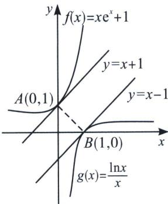

<!-- question-source:start -->
例13 (2024 云南师大附中高三适应性 T16) 已知点 $P$ 在函数 $f(x)=xe^{x}+1$ 的图象上, 点 $Q$ 在函数 $g(x)=\frac{\ln x}{x}$ 的图象上, 则 $|PQ|$ 的最小值为 \_\_\_\_.

(1)=1$ ，在 $B(1,0)$ 处的切线方程为 $y-0=1\times(x-1)$ ，整理可得 y=x-1；由直线 AB 的斜率 $k_{AB}=\frac{1-0}{0-1}=-1$ ，易知：直线 AB 分别与两条切线垂直，则 $\left|PQ\right|_{\min}=\frac{\left|-1-1\right|}{\sqrt{1^{2}+(-1)^{2}}}=\sqrt{2}$ 。故答案为： $\sqrt{2}$ 。
<!-- question-source:end -->

![[高中/总复习/专题/2026版高中《mst老唐说题》导数专题（数学）/上册/第02章_技能篇_导数的切线方程/第一节_基本切线方程/例题/answers/Q00046391A1.md]]
