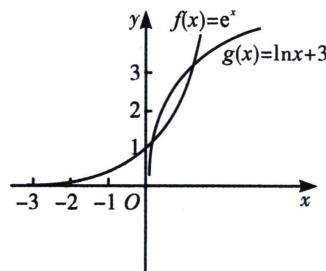
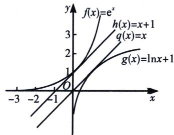

<!-- question-source:start -->
例19 (2023 南通基地大联考·多选 T12)已知 O 为坐标原点，曲线 $y=\ln x$ 在点 $P(x_{1},y_{1})$ 处的切线与曲线 $y=e^{x}$ 相切于点 $Q(x_{2},y_{2})$ ，则
A. $x_{1}y_{2}=1$ B. $\frac{x_{1}+1}{x_{1}-1}+x_{2}=0$ C. $\overrightarrow{OP} \cdot \overrightarrow{OQ}$ 的最大值为 0
D. 当 $x_{2}<0$ 时， $x_{1}+x_{2}>e^{2}-2$

(1) = e > 1$ ，所以 A 错误。

如图，a=3 时，设 $h(x)=e^{x}-\ln x-3,\quad h(e^{-3})>0,\quad h
(1)<0,\quad h
(2)>0$ ，则两曲线有两个公共点，故没有公切线，所以 B 错误.

a=2 时，设 $(t, e^{t})$ 是曲线 $y=e^{x}$ 上的一点， $y^{\prime}=e^{x}$ ，所以在点 $(t, e^{t})$ 处的曲线 $y=e^{x}$ 切线方程为 $y-e^{t}=e^{t}(x-t)$ ，即 $y=e^{t}x+(1-t)e^{t}$ ①，设 $(s, \ln s+2)$ 是曲线 $y=\ln x+a$ 上的一点， $y^{\prime}=\frac{1}{x}$ ，所以在点$(s, \ln s + 2)$ 处的切线方程为 $y - (\ln s + 2) = \frac{1}{s} (x - s)$ ，即 $y = \frac{1}{s} x + \ln s + 1$ ，所以 $\left\{ \begin{array}{l} e^t = \frac{1}{s} \\ (1 - t)e^t = \ln s + 1 \end{array} \right.$ ，解得 $t = 0$ 或 $t = 1$ ，所以两斜率分别是 1 和 $e$ ，所以 C 正确.

$$
a = 1
$$

$$
y = e ^ {x}
$$

$$
y = x + 1
$$

$$
y = \ln x + a
$$

$$
y = x
$$

$$
\frac {\sqrt {2}}{2}
$$
<!-- question-source:end -->

![[高中/总复习/专题/2026版高中《mst老唐说题》导数专题（数学）/上册/第02章_技能篇_导数的切线方程/第三节_切线的秘密/七_指对公切线与定值问题/例题/answers/Q00047088A1.md]]
