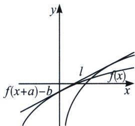
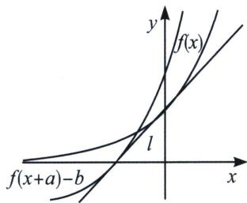

## 二、平行曲线的公切线

当 $y=f(x)$ 与 $y=g(x)$ 为平行曲线，即 $g(x)=f(x+a)-b$ ，则有 $f'(x_{1})=g'(x_{2})=\frac{f(x_{1})-g(x_{2})}{x_{1}-x_{2}}=\frac{b}{a}$

证明：因为 $y=f(x)$ 与 $g(x)=f(x+a)-b$ 有公切线，设 $y=f(x)$ 切点为 $(x_{1}, f(x_{1}))$ ， $y=g(x)=f(x+a)-b$ 切点为 $(x_{2}, f(x_{2}+a)-b)$ ，则一定有 $f'(x_{1})=f'(x_{2}+a)$ ，所以 $x_{1}=x_{2}+a$ ，根据公切线方程 $y_{2}-y_{1}=k(x_{2}-x_{1})$

可得： $f(x_{2}+a)-b-f(x_{1})=f'(x_{1})(x_{2}-x_{1})$ ，所以 $-b=-af'(x_{1})$ ，即 $f'(x_{1})=k=\frac{b}{a}$ 如果按照数形结合来理解，就是 $y=f(x)$ 与 $y=g(x)=f(x+a)-b$ ，两点确定公切线，两切点连线的斜率就是公切线斜率，即将切点 $(x_{1}, f(x_{1}))$ 左移 a 单位，再下移 b 单位，这样得到点 $(x_{1}-a, f(x_{1})-b)$ ，所以公切线斜率 $k=\frac{f(x_{1})-b-f(x_{1})}{x_{1}-a-x_{1}}=\frac{b}{a}$

![[高中/总复习/专题/2026版高中《mst老唐说题》导数专题（数学）/上册/第02章_技能篇_导数的切线方程/第三节_切线的秘密/二_平行曲线的公切线/例题/Q00047071.md]]
![[高中/总复习/专题/2026版高中《mst老唐说题》导数专题（数学）/上册/第02章_技能篇_导数的切线方程/第三节_切线的秘密/二_平行曲线的公切线/例题/Q00047072.md]]
![[高中/总复习/专题/2026版高中《mst老唐说题》导数专题（数学）/上册/第02章_技能篇_导数的切线方程/第三节_切线的秘密/二_平行曲线的公切线/例题/Q00047073.md]]
