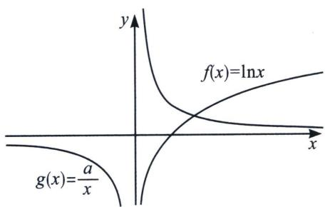
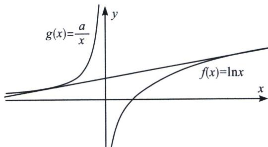
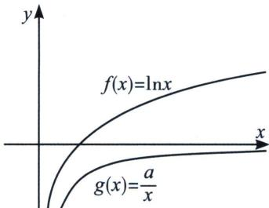
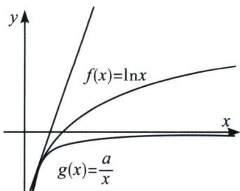
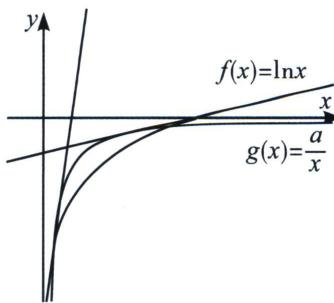

> [!faq]- 《导数专题(上册)》例题解析
>
> > [!success]- **【答案】** BCD
>
> > [!note]- **【解析】**
> > 解析 如左图，当 a>0 时，如左图所示， $f(x)$ 与 $g(x)$ 一个递增，一个递减，没有公切线，所以 A 错误；
> >
> > 
> >
> > 
> >
> > 当 $a < 0$ 时, 如右上图所示, $f(x)$ 第一象限与 $g(x)$ 第二象限存在一条公切线, 所以我们仅需要考虑
> >
> > $g(x)$ 在第四象限与 $f(x)$ 的交点情况；
> >
> > 
> >
> > 
> >
> > 
> >
> > 如左图所示，当 $f(x)>g(x)$ 恒成立时， $\ln x>\frac{a}{x}\Rightarrow x\ln x\geqslant-\frac{1}{e}>a$ ，两曲线只有一条公切线，故C正确；
> > 如中图所示，当 $f(x)\geqslant g(x)$ 恒成立时， $\ln x\geqslant\frac{a}{x}\Rightarrow x\ln x\geqslant-\frac{1}{e}=a$ ，两曲线恰有两条公切线，故B正确；
> > 如右图所示，当 $f(x)=g(x)$ 有两个交点时， $\ln x=\frac{a}{x}\Rightarrow a=x\ln x$ 有两个交点，两曲线有三条公切线，
> > 易知 $-\frac{1}{e}<a<0$ ，由于 $\left(-\frac{1}{e^{2}},0\right)\subseteq\left(-\frac{1}{e},0\right)$ ，故D正确；
> >
> > 故选 **BCD**.
