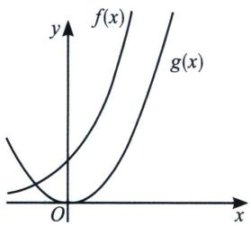
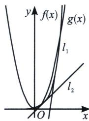
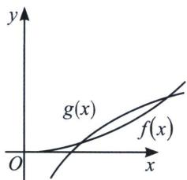
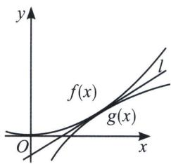
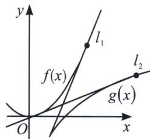

> [!faq]- 《导数专题(上)》例题解析
>
> > [!success]- **【答案】** D
>
> > [!note]- **【分析】**
> > 本题未单列分析。
>
> > [!note]- **【解析】**
> > 解析 解: 设曲线 $y = f(x)$ 与 $y = g(x)$ 的公共点为 $(x_0, y_0)$ , 因为 $f'(x) = \frac{6a^2}{x}$ , $g'(x) = 2x - 4a$ , 所以 $2x_0 - 4a = \frac{6a^2}{x_0}$ , 则 $x_0^2 - 2ax_0 - 3a^2 = 0$ , 解得 $x_0 = -a$ 或 $3a$ , 又 $x_0 > 0$ , 且 $a > 0$ , 则 $x_0 = 3a$ .
> > 因为 $f(x_{0})=g(x_{0})$ ，所以 $x_{0}^{2}-4ax_{0}-b=6a^{2}\ln x_{0}$ ， $b=-3a^{2}-6a^{2}\ln3a=-3a^{2}(1+\ln9a^{2})=-\frac{1}{3e}$ $9a^{2}e\ln(9a^{2}e)\leqslant\frac{1}{3e^{2}}$ ， $a=\frac{1}{3e}$ 时取等．故选D.
> > ## 四、公切线的几何解读
> > $y=f(x)$ 与 $y=g(x)$ 是否有公切线，决定它们公切线条数的是函数凹凸性和相同的单调区间交点.
> > 凹凸性相同的两曲线，在两个曲线 $f''(x)>0$ ， $g''(x)>0$ 时，两个函数均为凹函数，且 $f'(x)>0$ ， $g'(x)>0$ 时均在递增区间，
> > - **①**：如图，若 $y = f(x)$ 与 $y = g(x)$ 无交点，可以类比于两个圆的外公切线，当小圆内含于大圆时，无公切线；
> > - **②**：若 $y=f(x)$ 与 $y=g(x)$ 有唯一交点时，如图，可以类比于当小圆与大圆内切时，有唯一的外公切线；
> > - **③**：若 $y = f(x)$ 与 $y = g(x)$ 有两个交点时，如图，可以类比于当小圆与大圆相交时，有两条外公切线；
> > 
> > 内含型无公切线
> > 
> > 内切型有一条外公切线
> > 
> > 同旁相交型两条外公切线
> > 同理，凹凸性不同的两条曲线，在两个曲线 $f''(x)>0$ 为凹函数， $g''(x)<0$ 为凸函数时，且 $f'(x)>0$ ， $g'(x)>0$ ，两个函数均在递增区间；
> > - **④**：如图，若 $y=f(x)$ 与 $y=g(x)$ 有两个交点，可以类比圆的内公切线，当两圆相交时，无内公切线；
> > - **⑤**：若 $y=f(x)$ 与 $y=g(x)$ 有唯一交点时，如图所示，可以类比于当两圆外切时，有唯一的内公切线.
> > - **⑥**：若 $y=f(x)$ 与 $y=g(x)$ 无交点时，如图所示，可以类比于当两圆相离时，有两条内公切线.
> > 
> > 非同旁相交型无公切线
> > 
> > 外切型有一条内公切线
> > 
> > 外离型有两条内公切线
