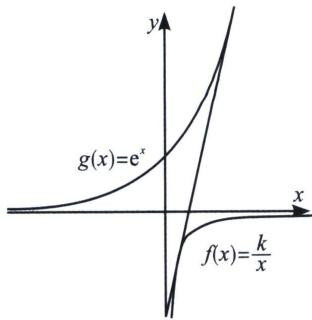
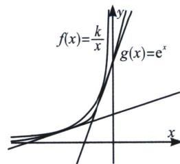

> [!faq]- 《导数专题(上)》例题解析
>
> > [!success]- **【答案】** A
>
> > [!note]- **【分析】**
> > 本题未单列分析。
>
> > [!note]- **【解析】**
> > 解析 由于 $f(x)$ 在第四象限与 $g(x)$ 位于第一象限的部分属于两弧外离型，受限于渐近线，故它们一定有一条公切线（左图），故我们仅需 $f(x)$ 在第二象限与 $g(x)$ 位于第二象限部分有两条公切线，此时一定要满足同旁相交型模型，才能有两条外公切线（右图）.
> > 
> > 
> > 这样仅需当 x<0 时， $f(x)=g(x)$ 有两个交点，即 $k=xe^{x}(x<0)$ 有两个交点，易知 x<0 时， $xe^{x}\in\left(-\frac{1}{e},0\right)$ ，且当 $x\in(-\infty,-1)$ 时， $xe^{x}\in\left(-\frac{1}{e},0\right)$ ，当 $x\in(-1,0)$ 时， $xe^{x}\in\left(-\frac{1}{e},0\right)$ ，所以 k 的取值范围为 $\left(-\frac{1}{e},0\right)$ 。
> >
> > 故选 **A**.
