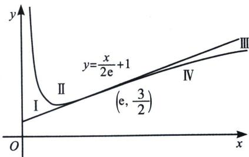

> [!faq]- 《导数专题(上册)》例题解析
>
> > [!success]- **【答案】** AC
>
> > [!note]- **【解析】**
> > 解析 对于 A，由圆 $C_{1}$ ： $x^{2} + y^{2} = 1$ 是直线族 $ax + by - 1 = 0$ 的包络线，可得 $\frac{1}{\sqrt{a^{2} + b^{2}}} = 1$ ，可得 $a^{2} + b^{2} = 1$ ，A 正确；
> >
> > 对于 B，设曲线 $C_{2}$ 的方程为 $(x-a)^{2}+(y-b)^{2}=r^{2}$ ，由曲线 $C_{2}$ 是直线族 $(1-t^{2})x+2ty-2t-4=0(t\in\mathbb{R})$ 的包络线，可得 $\frac{|(1-t^{2})a+2tb-2t-4|}{\sqrt{(1-t^{2})^{2}+(2t)^{2}}} = r$ ，即 $\frac{|-at^{2}+2(b-1)t+x-4|}{1+t^{2}} = r$ 因为 r 为定值，则 $\left\{\begin{aligned}&2(b-1)=0\\ &-a=a-4\end{aligned}\right.$ ，可得 $\left\{\begin{aligned}&a=2\\ &b=1\end{aligned}\right.$ ，此时 r=2，所以曲线 $C_{2}$ 的方程为 $(x-2)^{2}+(y-1)^{2}=4$ ，所以曲线 $C_{2}$ 的周长为 $4\pi$ ，B 错误；
> >
> > 对于 C，令曲线 $C_{3}$ ： $y=\frac{e}{2x}+\ln x$ 与过点 $(a,b)$ 的直线 l 相切于点 $(x_{0},y_{0})$ ，对 $y=\frac{e}{2x}+\ln x$ 求导得 $f'(x)=-\frac{e}{2x^{2}}+\frac{1}{x}$ ，由 $f'(x)=\frac{2x-e}{2x^{2}}>0$ ，得 $x>\frac{e}{2}$ ，所以 $f(x)$ 在 $\left(\frac{e}{2},+\infty\right)$ 上单调递增；由 $f'(x)=\frac{2x-e}{2x^{2}}<0$ ，得 $0<x<\frac{e}{2}$ ，所以 $f(x)$ 在 $\left(0,\frac{e}{2}\right)$ 上单调递减。 $f''(x)=\frac{e}{x^{3}}-\frac{1}{x^{2}}=0$ ，故拐点 $\left(e,\frac{3}{2}\right)$ ，拐点处的切线为 $y=\frac{x}{2e}+1$ ，拐点切线与 $y=f(x)$ 将平面划分为 I、II、III、IV 四个区域，如图，当 x>e 时，位于区域 III 内的任意一点能作 $y=f(x)$ 三条切线，所以满足 $f(a)<b<\frac{a}{2e}+1$ 。C 正确；
> >
> > 
> >
> > 对于 D，两曲线 $y=x^{2}-1$ 和 $y=a\ln x-1$ 是同一条直线的包络线，等价于两曲线 $y=x^{2}-1$ 和 $y=a\ln x-1$ 有公切线，a>0 保证两函数单调递增，且 $x^{2}-1 \geqslant a\ln x-1$ ，即 $a \leqslant \frac{x^{2}}{\ln x_{\min}} = \frac{2x^{2}}{\ln x_{\min}^{2}} = 2e$ ，D 错误。
> >
> > 故选 **AC**.
