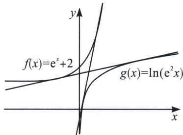

> [!faq]- 《导数专题(上册)》例题解析
>
> > [!success]- **【答案】** C
>
> > [!note]- **【解析】**
> > 解析 如图，令 $f(x)=e^{x}+2$ ， $g(x)=\ln(e^{2}x)=2+\ln x$ ，由于 $e^{x}>\ln x$ ，故 $f(x)>g(x)$ ，两个函数属于一凹一凸型，如图所示，且两函数相离，类比于两个相离的圆，一定有两条内公切线，如图所示，
> >
> > 
> >
> > 所以存在两条斜率分别为 $k_{1}$ ， $k_{2}$ 的直线与曲线 $y=e^{x}+2$ 和曲线 $y=\ln(e^{2}x)$ 都相切，
> >
> > 故选 **C**.
