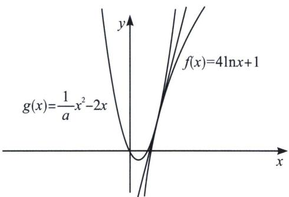
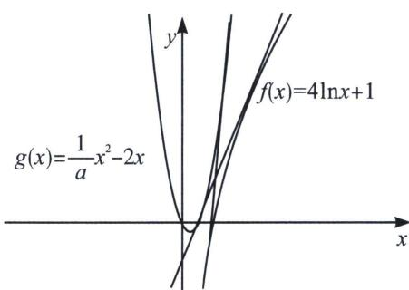

> [!faq]- 《导数专题(上册)》例题解析
>
> > [!success]- **【答案】** 详见解析
>
> > [!note]- **【分析】**
> > 本题未单列分析。
>
> > [!note]- **【解析】**
> > 解析 首先排除 $a \leqslant 0$ ，抛物线开口向下，无法在递增区间与 $f(x) = 4 \ln x + 1$ 有公切线，故 a > 0；
> > 
> > 
> > 如图所示，当 $g(x)\geqslant f(x)$ 时(左图)，或者 $g(x)>f(x)$ 时，两函数存在公切线，即 $\frac{1}{a}\geqslant\frac{2x+4\ln x+1}{x^{2}}$ $= h(x), h'(x) = \frac{2 - 2x - 8\ln x}{x^3}$ ，令 $\varphi (x) = 2 - 2x - 8\ln x, \varphi '(x) = -2 - \frac{8}{x} < 0$ ，由于 $h'
