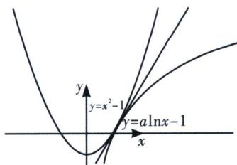
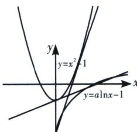

> [!faq]- 《导数专题(上册)》例题解析
>
> > [!success]- **【答案】** ABD
>
> > [!note]- **【分析】**
> > 本题未单列分析。
>
> > [!note]- **【解析】**
> > 解析 本题转化为 $f(x)=x^{2}$ 与 $g(x)=a\ln x$ 的关系问题，根据数形结合，我们作出两个函数的图像，一个为凹函数 $f(x)$ ，一个为凸函数 $g(x)$ ，由于在区间 $(0,+\infty)$ ，两个函数都位于递增区间 $(a\leqslant0$ 时不符合单调性相同，矛盾，被排除），此时类比于两个圆寻找内公切线模型，只要 $f(x)\geqslant g(x)$ 恒成立，即 $a\leqslant\left(\frac{x^{2}}{\ln x}\right)_{\min}=2e$ 结合选项可得，正实数a的取值可能是ABD，故选ABD.
> > 
> > 
