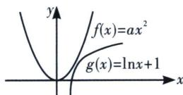
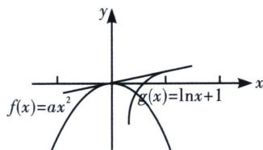

> [!faq]- 《导数专题(上册)》例题解析
>
> > [!success]- **【答案】** ABC
>
> > [!note]- **【分析】**
> > 本题未单列分析。
>
> > [!note]- **【解析】**
> > 解析 当 $a > 0$ 时，两函数符合一凹一凸内公切线类型， $a \geqslant \left(\frac{\ln x + 1}{x^2}\right)_{\max} = \left(\frac{\ln ex}{x^2}\right)_{\max} = \left(\frac{e^2}{2} \frac{\ln e^2 x^2}{e^2 x^2}\right)_{\max} = \frac{e}{2}$
> > 
> > 
> > 当 a<0 时，根据图像可知，在各自递增区间，类比于外公切线模型一定存在一条公切线；
> > 结合选项可得，实数 a 的可能取值是 ABC，
> >
> > 故选 **ABC**.
