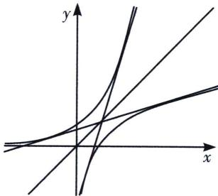
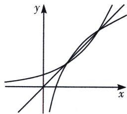
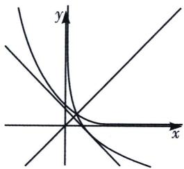
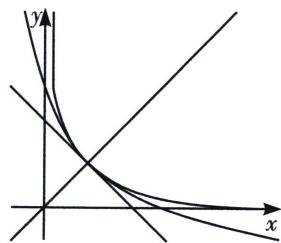
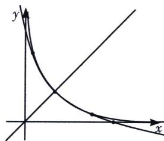

> [!faq]- 《导数专题(上)》例题解析
>
> > [!success]- **【答案】** 详见解析
>
> > [!note]- **【分析】**
> > 本题未单列分析。
>
> > [!note]- **【解析】**
> > (1) 若 $a^x > x > \log_a x$ ，两函数没有交点，此时能出现两条公切线，也相当于两个外离的圆弧的公切线，如图，此时 $a^x > x$ ，则 $e^{x\ln a} > x \Rightarrow x\ln a > \ln x \Rightarrow \ln a > \frac{\ln x}{x_{\max}} = \frac{1}{e}$ ，所以 $a > e^{\frac{1}{e}}$ 时，必有两条公切线，且两条公切线斜率乘积为 1；
> > 证明：设 $y = k_{1}x + b$ 与 $y = a^{x}$ 切于 $(x_{1},y_{1})$ ，与 $y = \log_{a}x$ 切于 $(x_{2},y_{2})$ ，则根据对称性，另一条切线比过 $(y_{1},x_{1})$ 和 $(y_{2},x_{2})$ ，所以必有 $k_{2} = \frac{x_{2} - x_{1}}{y_{2} - y_{1}} = \frac{1}{k_{1}}$
> > (2) $1 < a < e^{\frac{1}{e}}$ 时, $y = a^{x}$ 与 $y = \log_{a} x$ 有两个交点, 故没有公切线如右图;
> > 
> > (1) $a>e^{\frac{1}{e}}$ ，两条公切线
> > 
> > (2) $1 < a < e^{\frac{1}{e}}$ ，没有公切线
> > 我们再来分析 $0 < a < 1$ ，在这里就会出现一个或者三个交点的情况，我们做以下分析：
> > 
> > 
> > (3) $1 > a > e^{-e}$ 一个交点
> > 
> > (4) $a=e^{-e}$ 一个交点(相切)
> > (5) $0 < a < e^{-1}$ 三个交点
> > 我们发现 a 越小，根据 $(a^{x})' = a^{x} \ln a$ ，函数递减越慢，临界条件就是 $a^{x}$ 与 $\log_{a} x$ 相切于 y = x，且切线斜率为 -1，所以 $\frac{1}{x_{0} \ln a} = -1 \Rightarrow \frac{1}{x_{0}} = -\ln a$ ，且 $a^{x_{0}} = x_{0} \Rightarrow e^{x_{0} \ln a} = x_{0} \Rightarrow \ln a = \frac{\ln x_{0}}{x_{0}} = -\ln a \ln x_{0} \Rightarrow x_{0} = \frac{1}{e}$ ，所以 $a = e^{-e}$ ，
> > (3) 当 $1 > a > e^{-e}$ 时, 如左图所示, 两个函数仅有一个交点, 此时也有一条公切线;
> > (4)当 $a = e^{-e}$ 时，两个函数拟合，就是在交点处相切，如中图，此时共切线点公切线一条；
> > (5)当 $0 < a < e^{-1}$ 时，两函数会出现三个零点，会有三条公切线，如右图，类比于 $a > e^{\frac{1}{e}}$ 三条公切线中 $k_{1}k_{3} = 1, k_{2} = -1$ ;
> > ## 2. $e^{x}$ 与 $\ln x$ 公切线的切点数据关系
> > (1) 若 $y = e^{x}$ 在点 $(x_{1}, y_{1})$ 处的切线与曲线 $y = \ln x$ 在点 $(x_{2}, y_{2})$ 处的切线相同，则 $e^{x_{1}} = \frac{1}{x_{2}} = \frac{x_{1} + 1}{x_{1} - 1}$
> > 证明：本题我们可以尝试切线找点，常规法大家可以参考例题22，切线找点的转化也属于同构思想，我们应该重点掌握， $e^{x-x_{1}}\geqslant x-x_{1}+1\Rightarrow e^{x}\geqslant e^{x_{1}}x+e^{x_{1}}(1-x_{1}),\ln\frac{x}{x_{2}}\leqslant\frac{x}{x_{2}}-1\Rightarrow\ln x\leqslant\frac{x}{x_{2}}+\ln x_{2}-1$ ，故此时满足 $\left\{\begin{aligned}e^{x_{1}}&=\frac{1}{x_{2}}\\ &e^{x_{1}}(1-x_{1})&=\ln x_{2}-1=-x_{1}-1\end{aligned}\right.\Leftrightarrow\left\{\begin{aligned}e^{x_{1}}&=\frac{1}{x_{2}}=\frac{x_{1}+1}{x_{1}-1}\\ &e^{x_{1}}(1-x_{1})&=\ln x_{2}-1=-x_{1}-1\end{aligned}\right.$
