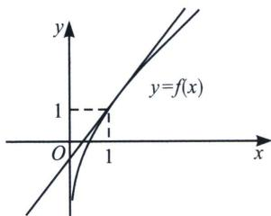
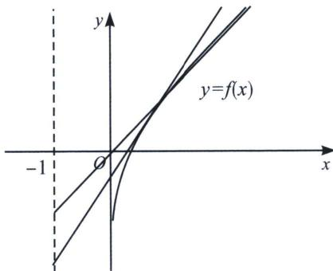

> [!faq]- 《导数专题(上册)》例题解析
>
> > [!success]- **【答案】** AB
>
> > [!note]- **【解析】**
> > 解析 函数 $f(x)=x+\ln x$ 的定义域为 $(0,+\infty)$ ， $f'(x)=1+\frac{1}{x}$ ，设曲线 $f(x)=x+\ln x$ 上的切点坐标为 $(x_0,x_0+\ln x_0)$ ，切线斜率为 $1+\frac{1}{x_0}$ ，则切线方程为 $y=\left(1+\frac{1}{x_0}\right)(x-x_0)+x_0+\ln x_0=\left(1+\frac{1}{x_0}\right)x-1+\ln x_0$ ，所以 $k=1+\frac{1}{x_0}$ ， $m=-1+\ln x_0=\ln\frac{1}{k-1}-1=-\ln(k-1)-1$ ，A选项正确；
> >
> > 
> >
> > 
> >
> > 我们分析 $f''(x)=-\frac{1}{x^{2}}<0$ ，故 $f(x)$ 为上凸函数，故当x=1时， $f(1)=1$ ， $l:y=kx+m$ 始终在 $f(x)$ 上方，故当直线切 $f(x)$ 于(1,1)时， $k+m$ 取得最小值1，如左图，故B正确；
> >
> > 易知 $k-m=-(k(-1)+m)$ ，通过作图（右图），当 $y\to-\infty$ 时依然能作 $f(x)$ 切线，故 C 错误；
> > m=-2k 时，直线过定点 $(2,0)$ ，易知这个点在曲线内弧区域，直线 l 不存在，D 选项错误。故
> >
> > 选 AB.
