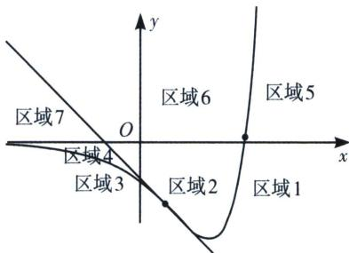

## 三、任意函数拐点与渐近线对切线条数界定

关于 $f(x)=(x+a)e^{x}$ 切线条数问题，由于 $f'(x)=(x+a+1)e^{x}$ ， $f''(x)=(x+a+2)e^{x}$ ，当x=-a-2时， $f''(x)=0$ ，此处 $(-a-2,-2e^{-a-2})$ 为函数的拐点，易求拐点处切线方程为 $y=-e^{-a-2}(x+a+4)$ ，当 $x\to-\infty$ 时， $f(x)\to0$ ，我们把y=0称为此函数的渐近线，区别于三次函数只有拐点，故我们通过拐点切线和渐近线，将平面分为7个区域，我们可以对此类型题进行归纳总结，如下：

当 y<0 时，函数 $y=f(x)$ 与拐点处切线 $y=-e^{-a-2}(x+a+4)$ 以及 x 轴（渐近线）将平面分成四个区域（如图所示），分别由两个外弧区域和两个内弧区域组成，

①区域1和区域4属于双外弧区域，位于此区域的点能作 $y=f(x)$ 三条切线；

②区域2和区域3属于一内弧一外弧区域，位于此区域的点能作 $y=f(x)$ 一条切线；

我们将拐点切线作为内外弧分界点，区域 2 就是拐点右侧曲线的内弧区域，但是相对于曲线左侧，则是外弧区域，所以只能往拐点左侧区域作唯一一条切线，也是“远切线”；同理，区域 3 是拐点左侧曲线的内弧区域，也是拐点右侧曲线的外弧区域，所以过区域3的任意一点能作唯一一条切点位于拐点右侧的“远切线”；那么区域1和区域4就是拐点左右两侧的双外弧区域，在本侧能作两条切点位于拐点同侧的“近切线”，以及一条拐点另一侧的“远切线”。

③过曲线上拐点处仅能作一条切线，过拐点以外的曲线上任意一点能作两条切线；

在曲线上任意一点能作一条切线，这可以理解为拐点同侧外弧的两条切线合二为一，类比于圆，圆上一点能作一条切线，就是圆外的两条切线在这里合二为一，还有一条切线源自拐点另一处的“远切线”.

④过拐点处切线上除了拐点以外的任意一点，仅能作两条切线；

拐点切线，就是一条“近切线”和一条“远切线”合二为一，否则就会有三条切线.

当 $y \geqslant 0$ 时，函数 $y = f(x)$ 与拐点处切线 $y = -e^{-a-2}(x + a + 4)$ 以及 x 轴将平面分成三个区域（如图所示），分别由两个外弧区域和一个内弧区域组成，由于不在渐近线内侧，故少了一条“远切线”。

⑤区域5和区域7属于双外弧区域，位于此区域的点能作 $y=f(x)$ 两条切线，相比区域1和区域4，少了一条位于 $x\to-\infty$ 处的远切线； $v⑥$ 区域6属于一内弧一外弧区域，由于唯一一条远切线的缺失，故位于此区域的点不能作 $y=f(x)$ 的切线；

⑦由于缺失了一条远切线，故过曲线上任意一点仅能作一条切点在曲线上切线；

⑧过拐点处切线上任意一点仅能作唯一切线，就是这条拐点切线.

![[高中/总复习/专题/2026版高中《mst老唐说题》导数专题（数学）/上册/第02章_技能篇_导数的切线方程/第二节_函数的切线界定/三_任意函数拐点与渐近线对切线条数界定/例题/Q00047060.md]]
![[高中/总复习/专题/2026版高中《mst老唐说题》导数专题（数学）/上册/第02章_技能篇_导数的切线方程/第二节_函数的切线界定/三_任意函数拐点与渐近线对切线条数界定/例题/Q00047061.md]]
![[高中/总复习/专题/2026版高中《mst老唐说题》导数专题（数学）/上册/第02章_技能篇_导数的切线方程/第二节_函数的切线界定/三_任意函数拐点与渐近线对切线条数界定/例题/Q00047062.md]]
![[高中/总复习/专题/2026版高中《mst老唐说题》导数专题（数学）/上册/第02章_技能篇_导数的切线方程/第二节_函数的切线界定/三_任意函数拐点与渐近线对切线条数界定/例题/Q00047063.md]]
![[高中/总复习/专题/2026版高中《mst老唐说题》导数专题（数学）/上册/第02章_技能篇_导数的切线方程/第二节_函数的切线界定/三_任意函数拐点与渐近线对切线条数界定/例题/Q00047064.md]]
![[高中/总复习/专题/2026版高中《mst老唐说题》导数专题（数学）/上册/第02章_技能篇_导数的切线方程/第二节_函数的切线界定/三_任意函数拐点与渐近线对切线条数界定/例题/Q00047065.md]]
![[高中/总复习/专题/2026版高中《mst老唐说题》导数专题（数学）/上册/第02章_技能篇_导数的切线方程/第二节_函数的切线界定/三_任意函数拐点与渐近线对切线条数界定/例题/Q00047066.md]]
![[高中/总复习/专题/2026版高中《mst老唐说题》导数专题（数学）/上册/第02章_技能篇_导数的切线方程/第二节_函数的切线界定/三_任意函数拐点与渐近线对切线条数界定/例题/Q00047067.md]]
![[高中/总复习/专题/2026版高中《mst老唐说题》导数专题（数学）/上册/第02章_技能篇_导数的切线方程/第二节_函数的切线界定/三_任意函数拐点与渐近线对切线条数界定/例题/Q00052632.md]]
