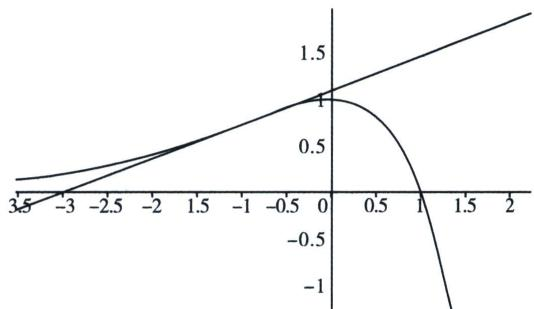

> [!faq]- 《导数专题(上册)》例题解析
>
> > [!success]- **【答案】** C
>
> > [!note]- **【解析】**
> > 解析 法一：设切点为 $(t, (1 - t)e^t)$ ， $y' = -xe^x$ ，所以 $y'|_{x=t} = -te^t$ ，则切线方程为 $y - e^t + te^t =$ $-te^{t}(x-t)$ ，切线过点 $A(a,0)$ ，代入得 $-e^{t}+te^{t}=-te^{t}(a-t)$ ，所以 $t^{2}-(a+1)t+1=0$ ，即方程 $t^{2}-(a+1)t+1=0$ 有两个相等的实数根，则 $\triangle=(a+1)^{2}-4=a^{2}+2a-3=0$ ，解得a=-3或a=1.
> > 法二：（拐点切线界定） $y=(1-x)e^{x}$ ， $y'=-xe^{x}$ ， $y''=-(x+1)e^{x}=0\Rightarrow x=-1$ ，故 $\left\{\begin{aligned}&x<0,&f'(x)>0,&f(x)\uparrow\\&x>0,&f'(x)<0,&f(x)\downarrow\end{aligned}\right.$ ，拐点切线为： $y=\frac{x+3}{e}$ ，当 $\left\{\begin{aligned}&x<1,&f(x)>0\\&x>1,&f(x)<0\end{aligned}\right.$ ，如图所示：
> > A(a,0)作曲线 $y=(1-x)e^{x}$ 的切线有且仅有 1 条，则点 A(a,0) 为函数与 x 轴交点或者拐点切线与 x 轴交点，所以 a=-3 或 a=1 故选 C.
> >
> > 
