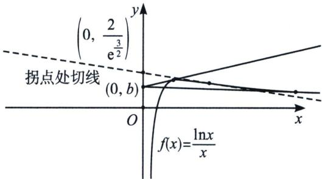

> [!faq]- 《导数专题(上册)》例题解析
>
> > [!success]- **【答案】** D
>
> > [!note]- **【解析】**
> > 解析 $f^{\prime}(x) = \frac{1 - \ln x}{x^{2}}, f^{\prime \prime}(x) = \frac{2\ln x - 3}{x^{3}} = 0, x = e^{\frac{3}{2}}$ ，拐点处切线为 $y = -\frac{x}{2e^3} + \frac{2}{e^{\frac{3}{2}}} (\text{虚线})$ ，与 $y$ 轴交点为 $\left(0, \frac{2}{e^{\frac{3}{2}}}\right)$ ，由于 $y$ 轴为此函数的渐近线，故当 $b \in \left(0, \frac{2}{e^{\frac{3}{2}}}\right)$ 时，能作一条近切线（切点在拐点左侧）和一条远切线（切点在拐点右侧），如图所示。故选D.
> >
> > 
