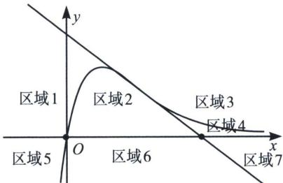

> [!faq]- 《导数专题(上册)》例题解析
>
> > [!success]- **【答案】** ABD
>
> > [!note]- **【解析】**
> > 解析 作曲线 $f(x)=\frac{x}{e^{x}}$ 的图像，并求得其拐点处 $\left(2,\frac{2}{e^{2}}\right)$ 切线方程为 $y=\frac{-x+4}{e^{2}}$ ，如图所示，
> >
> > 
> >
> > 对于 A，当 a=0, b=0 时，点 $(0,0)$ 在函数 $f(x)=\frac{x}{e^{x}}$ 的图象上，过 y>0 的曲线上任意一点能作曲线 $f(x)$ 的两条切线，过 $y\leqslant0$ 的曲线上任意一点仅能作曲线 $f(x)$ 的一条切线，故 A 正确；
> >
> > 对于 B，当 a=0 时，y 轴被 $f(x)$ 和拐点处切线分为三段，当位于区域 1 的部分，即 $0<b<\frac{4}{e^{2}}$ ，可作三条切线，故 B 正确；
> >
> > 对于 C，当 a=2, b>0 时，易知位于区域 2 和区域 3，属于内弧区域，此区域的点能作 $y=f(x)$ 一条切线，故 C 错误；
> >
> > 对于 D，当 0 < a < 2 时，位于拐点左侧，可作两条切线，故只能在曲线 $f(x) = \frac{x}{e^{x}}$ 的图象或者拐点处切线 $y = \frac{-x + 4}{e^{2}}$ 上，则 b 的取值为 $\frac{4 - a}{e^{2}}$ 或 $\frac{a}{e^{a}}$ ，故 D 正确。
> >
> > 故选 **ABD**.
