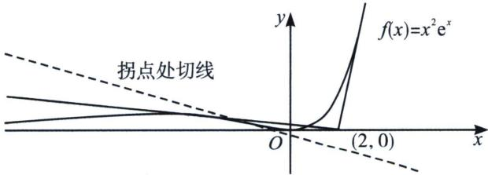

> [!faq]- 《导数专题(上册)》例题解析
>
> > [!success]- **【答案】** C
>
> > [!note]- **【解析】**
> > 解析 法一：设切点 $P(x_0, x_0^2 e^{x_0})$ ，由 $y = x^2 e^x$ ，得 $y' = 2x \cdot e^x + x^2 \cdot e^x = (x^2 + 2x)e^x$ ，所以 $y'|_{x=x_0} = (x_0^2 + 2x_0)e^{x_0}$ ，则过切点的切线方程为 $y - x_0^2 e^{x_0} = (x_0^2 + 2x_0)e^{x_0}(x - x_0)$ ，把(2, 0)代入，可得 $-x_0^2 e^{x_0} = (x_0^2 + 2x_0)e^{x_0}(2 - x_0)$ ，整理得， $x_0e^{x_0}(x_0^2 - x_0 - 4) = 0$ 。所以 $x_0 = 0$ 或 $x_0^2 - x_0 - 4 = 0$ ，方程 $x_0^2 - x_0 - 4 = 0$ 的判别式 $\triangle = 17 > 0$ ，方程有两个不等非 0 根，则经过点(2, 0)作曲线 $y = x^2 e^x$ 的切线有 3 条。
> >
> > 法二：先求导 $f'(x)=(x^{2}+2x)e^{x}=0$ 时，x=0或x=-2，故原点为函数极值点，那么x轴一定是函数的一条切线，由于x<-2时， $f(x)$ 单调递增，故过点(2,0)做 $f(x)$ 切线时，切点不会位于区间 $(-∞,-2)$ ， $f''(x)=(x^{2}+4x+2)e^{x}$ ，拐点 $x_{0}=-2+\sqrt{2}$ ，拐点处切线与x轴交点显然位于负半轴，过点(2,0)能作三条切线，其中两条近切线，分别为x轴和切点位于第一象限的切线，另外一条远切线，切点 $x∈(-2,-2+\sqrt{2})$ 。故选C。
> >
> > 
