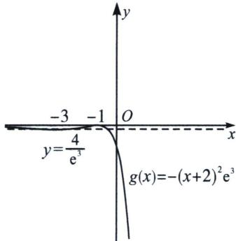
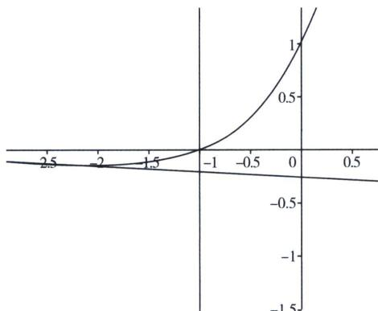

> [!faq]- 《导数专题(上册)》例题解析
>
> > [!success]- **【答案】** BCD
>
> > [!note]- **【解析】**
> > 解析 法一：设过点 $P(-1, a)$ 的切线 l 与函数 $f(x)$ 的切点为 $(x_{0}, (x_{0}+1)e^{x_{0}})$ ，因为 $f'(x)=(x+2)e^{x}$ ，则切线 l 的斜率为 $k=f'(x_{0})=(x_{0}+2)e^{x_{0}}$ ，所以切线 l 的方程为： $y-(x_{0}+1)e^{x_{0}}=(x_{0}+2)e^{x_{0}}(x-x_{0})$ ，代入 $P(-1, a)$ ，得 $a-(x_{0}+1)e^{x_{0}}=(x_{0}+2)e^{x_{0}}(-1-x_{0})\Rightarrow a=-(x_{0}+1)^{2}e^{x_{0}}$ ，令 $g(x)=-(x+1)^{2}e^{x}$ ，则 $g'(x)=[-2(x+1)-(x+1)^{2}]e^{x}=-(x+1)(x+3)e^{x}$ ，由 $g'(x)=0$ ，得 x=-1，x=-3，当 x<-3，x>-1 时， $g'(x)<0$ ， $g(x)$ 在 $(-∞,-3)$ ， $(-1,+∞)$ 上单调递减；当 -3<x<-1 时， $g'(x)>0$ ， $g(x)$ 在 $(-3,-1)$ 上单调递增；
> >
> > 所以 $g(x)$ 在 x=-3 处取得极小值 $g(-3)=-\frac{4}{e^{3}}$ ，在 x=-1 处取得极大值 $g(-1)=0$ ，又因为 $e^{x}>0$ ， $(x-1)^{2}\leqslant0$ ，则 $g(x)=-(x+1)^{2}e^{x}\leqslant0$ ，所以 $g(x)$ 的最大值为 $g(-1)=0$ ；
> >
> > 且当 $x \to -\infty$ 时， $g(x) \to 0$ ，当 $x \to +\infty$ 时， $g(x) \to -\infty$ ， $g(x)$ 的图像如图所示：
> >
> > 
> >
> > $$
> > a \leqslant 0
> > $$
> >
> > 对于B选项，可知 $[na]_{\max} = g(x)_{\max} = 0$ ，所以 $na$ 的最大值为0，故B选项正确；  
> > 对于C选项，当函数 $f(x)$ 图像上动点的切线斜率平行于直线 $2x - y - 4 = 0$ 时，距离最小，即 $f^{\prime}(x_0) = (x_0 + 2)e^{x_0} = 2$ ，令 $h(x) = (x + 2)e^x$ ，则 $h^{\prime}(x) = (x + 3)e^{x}$ ，当 $x > -3$ 时， $h^{\prime}(x) > 0$ ， $h(x)$ 在 $(-3, +\infty)$ 上单调递增；当 $x < -3$ 时， $h^{\prime}(x) < 0$ ， $h(x)$ 在 $(- \infty, -3)$ 上单调递减；且 $x < -2$ 时， $h(x) < 0$ 恒成立，即直线 $y = 2$ 与函数 $h(x) = (x + 2)e^x$ 有且仅有一个交点；所以 $(x_0 + 2)e^{x_0} = 2$ 有唯一解，即 $x_0 = 0$ ，则 $f(0) = (0 + 1)e^0 = 1$ ，该函数 $f(x)$ 图像上动点到直线 $2x - y - 4 = 0$ 的距离最小值等于(0,1)到直线 $2x - y - 4 = 0$ 的距离 $d = \frac{|2\times 0 - 1 - 4|}{\sqrt{5}} = \sqrt{5}$ ，故C选项正确；对于D选项，由图可知 $n = 1$ 时， $a < -\frac{4}{e^3}$ 或 $a = 0$ ，故D选项正确．故选BCD.法二：（拐点切线界定）对于ABD选项，由法一，拐点为 $\left(-3, -\frac{2}{e^3}\right)$ ，拐点切线为： $y = -\frac{(x + 5)}{e^3}$ ，如图：
> >
> > 
> >
> > 拐点切线与 x=-1 交点为 $\left(-1, -\frac{4}{e^{3}}\right)$ ，显然：当 a>0, n=0；a=0 或者 $a=-\frac{4}{e^{3}}$ , n=1，当 $-\frac{4}{e^{3}}$ <a<0, n=3, 当 $a<-\frac{4}{e^{3}}$ , n=2; 故 n 的最大值为 3, na 的最大值为 0.
> >
> > 故选 **BCD**.
