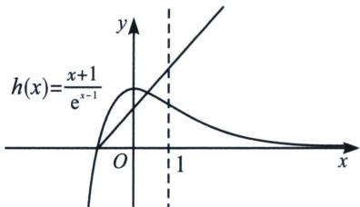
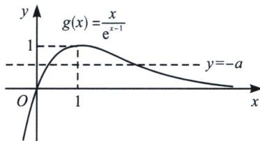

> [!faq]- 《导数专题(上册)》例题解析
>
> > [!success]- **【答案】** ACD
>
> > [!note]- **【解析】**
> > 解析 对于 A， $f'(x)=-\frac{x}{e^{x-1}}-a$ ，因为函数 $f(x)$ 在 R 上单调递增，所以 $f(x)\geqslant0$ 恒成立，即 $-a\geqslant\frac{x}{e^{x-1}}=\frac{ex}{e^{x}_{\max}}=1$ 恒成立，即 $a\leqslant-1$ ，故 A 正确；
> >
> > 对于 B，由 $f(x)>a-1$ 得 $h(x)=\frac{x+1}{e^{x-1}}>a(x+1)=p(x)$ ，如图， $h(1)=2,\ p(1)=2a$ ，当 $a\in(1,2)$ 时， $h(1)<p(1)$ ，故 B 错误；
> >
> > 
> >
> > 
> >
> > 
> >
> > 对于 C，因为函数 $f(x)$ 有两个极值点 $x_{1}$ ， $x_{2}$ ，且 $x_{2} > 2x_{1}$ ，所以 $f'(x) = -\frac{x}{e^{x-1}} - a$ 有两个零点 $x_{1}$ ， $x_{2}$ ，即方程 $-a = \frac{x}{e^{x-1}}$ 有两个解为 $x_{1}$ ， $x_{2}$ ，设 $g(x) = \frac{x}{e^{x-1}}$ ，函数 $g(x)$ 在 x = 1 处取得最大值 $g(1) = 1$ ，令 $x_{2} = 2x_{1}$ ，则 $\frac{x_{1}}{e^{x_{1}-1}} = \frac{x_{2}}{e^{x_{2}-1}} = \frac{2x_{1}}{e^{2x_{1}-1}}$ ，解得 $x_{1} = \ln 2$ ，此时 $-a = \frac{x_{1}}{e^{x_{1}-1}} = \frac{\ln 2}{e^{\ln 2}-1} = \frac{e\ln 2}{2}$ ，即 $a = -\frac{e\ln 2}{2}$ ，方程 $-a = \frac{x}{e^{x-1}}$ 有两个解为 $x_{1}$ ， $x_{2}$ 等价于 y = -a 与 $y = \frac{x}{e^{x-1}}$ 有两个交点，作出两函数图象，如图所示：由图象可得 $0 < -a < \frac{e\ln 2}{2}$ ，解得 $-\frac{e\ln 2}{2} < a < 0$ ，故 C 正确；
> >
> > 对于 D, a=1 时， $f(x)=\frac{x+1}{e^{x-1}}-x-1$ ， $f'(x)=-\frac{x}{e^{x-1}}-1$ ， $f''(x)=\frac{x-1}{e^{x-1}}=0$ 时，x=1，故拐点为 $(1,0)$ ，拐点处切线为： $y=-2x+2$ ，如图，拐点切线与 y 轴交点为 $(0,2)$ ，故过 $(0,3)$ 仅能做曲线 $y=f(x)$ 的一条左侧的近切线，故 D 正确。
> >
> > 故选 **ACD**.
