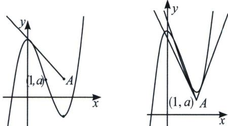

<!-- question-source:start -->
例9 (2023 浙江浙南名校联盟第一次联考·多选 T12)已知函数 $f(x)=ax^{3}-3ax^{2}+b$ ，其中实数 $a>0, b \in R$ ，点 $A(2, a)$ ，则下列结论正确的是（）
A. $f(x)$ 必有两个极值点
B. 当 $b=2a$ 时，点 $(1,0)$ 是曲线 $y=f(x)$ 的对称中心
C. 当 $b=3a$ 时，过点 A 可以作曲线 $y=f(x)$ 的 2 条切线
D. 当 $5a<b<6a$ 时，过点 A 可以作曲线 $y=f(x)$ 的 3 条切线

(1) = 0$ , 所以点 (1, 0) 是曲线 $y = f(x)$ 的对称中心, 所以 B 正确;

对于 C，当 b=3a 时， $f(x)=ax^{3}-3ax^{2}+3a$ ，(1, a) 是对称中心， $f
(2)=-a$ ，如左图可知 A 位于内弧区域，过 A 作切线，有仅有一条，所以 C 不正确；

对于 D， $f
(2)=-4a+b>a$ ，如右图，A 位于外弧区域区间，故当 5a<b<6a 时，过点 A 可以作曲线 $y=f(x)$ 的 3 条切线，故 D 正确。故选 ABD.
<!-- question-source:end -->

![[高中/总复习/专题/2026版高中《mst老唐说题》导数专题（数学）/上册/第02章_技能篇_导数的切线方程/第二节_函数的切线界定/二_三次函数拐点与切线条数界定/例题/answers/Q00047056A1.md]]
