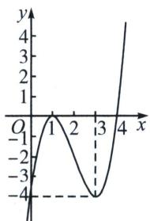
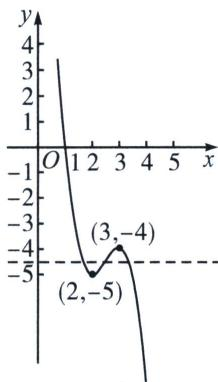

<!-- question-source:start -->
例12 (2025 齐齐哈尔期中 T11) 设 $f'(x)$ 是 $f(x)$ 的导函数, $f''(x)$ 是函数 $f'(x)$ 的导函数. 若方程 $f''(x)=0$ 有实数解 $x_0$ , 且在 $x_0$ 的左、右附近, $f''(x)$ 异号, 则称点

$(x_{0}, f(x_{0}))$ 为函数 $y=f(x)$ 的“拐点”。经过探究发现：任何一个三次函数都有“拐点”且“拐点”就是三次函数图象的对称中心。已知函数 $f(x)=ax^{3}+bx^{2}+9x-4(ab\neq0)$ 的对称中心为 $(2,-2)$ ，则下列说法中正确的是（）
A. a=1, b=6
B. $f(x)$ 的极小值为 -4
C. 若函数 $f(x)$ 在区间 $(m, 4)$ 上存在最小值，则 m 的取值范围为 $[0, 3)$ D. 若过点 $(3, m)$ 可以作三条直线与 $y=f(x)$ 的图象相切，则 m 的取值范围为 $(-5, -4)$

$$
f ^ {\prime} (x) = 3 a x ^ {2} + 2 b x + 9
$$

$$
f ^ {\prime \prime} (x) = 6 a x + 2 b
$$

$$
f ^ {\prime \prime}
(2) = 1 2 a + 2 b = 0
$$

$$
f
(2) = 8 a + 4 b + 1 8 - 4 = - 2
$$

$$
f (x) = x ^ {3} - 6 x ^ {2} + 9 x - 4
$$

$$
f ^ {\prime} (x) = 3 x ^ {2} - 1 2 x + 9 = 3 (x - 1) (x - 3)
$$

$$
x <   1
$$

$$
x > 3
$$

$$
f ^ {\prime} (x) <   0
$$

$$
1 <   x <   3
$$

$$
f ^ {\prime} (x) > 0
$$

$$
f
(3) = - 4
$$

令 $f(x)=-4$ ，解得x=0或3，函数 $f(x)$ 在区间 $(m,4)$ 上存在最小值，由图1可知，m的取值范围为 $[0,3)$ ，故C选项正确；

对于 D: 法一: 设切点为 $(c, d)$ , 则切线的斜率为 $k = f'(c) = 3c^2 - 12c + 9$ , 所以切线方程为 $y - d = (3c^2 - 12c + 9)(x - c)$ , 即 $y - (c^3 - 6c^2 + 9c - 4) = (3c^2 - 12c + 9)(x - c)$ , 因为切线经过点 $(3, m)$ ,所以 $m-(c^{3}-6c^{2}+9c-4)=(3c^{2}-12c+9)(3-c)$ ，整理得 $m=-2c^{3}+15c^{2}-36c+23$ ，由题意可知关于 c 的方程 $m=-2c^{3}+15c^{2}-36c+23$ 有 3 个不等的根，令 $g(x)=-2x^{3}+15x^{2}-36x+23$ ，则 $g'(x)=-6x^{2}+30x-36$ ，令 $g'(x)<0$ ，得 x<2 或，令 $g'(x)>0x>3$ ，得 2<x<3，所以 $g(x)$ 在 $(-∞,2)$ 和 $(3,+∞)$ 上单调递减，在 $(2,3)$ 上单调递增，所以 $g(x)$ 的极小值为 $g
(2)=-5$ ，极大值为 $g
(3)=-4$ ，所以 $g(x)$ 的大致图象如图 2 所示，由图象可知当 -5<m<-4 时，直线 y=m 与 $g(x)$ 的图象有 3 个交点，即当 -5<m<-4 时，过 $(3,m)$ 可以作三条直线与 $y=f(x)$ 图象相切，故 D 选项正确.

  
图1

  
图2

法二：拐点切线： $f'
(2)=-3,\quad y+2=-3(x-2)\Rightarrow y=-3x+4$ ，故由图像 $(3,m)$ 在 $y=-3x+4$ 上方，在 $f(x)=x^{3}-6x^{2}+9x-4$ 下方，即 $-3\times3+4<m<3^{3}-6\times3^{2}+9\times3-4$ ，即-5<m<-4。故选BCD.
<!-- question-source:end -->
