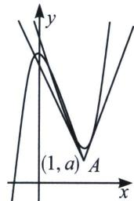

<!-- question-source:start -->
例10 (2025 银川一中月考 T11) 已知函数 $f(x) = ax^3 - 3ax^2 + b$ ，其中实数 $a > 0, b \in \mathbb{R}$ ，则下列结论正确的是

A. $f(x)$ 在 $(0, +\infty)$ 上单调递增

B. 当 $f(x)$ 有且仅有3个零点时，b的取值范围是(0,4a)

C. 若直线 $l$ 与曲线 $y = f(x)$ 有3个不同的交点 $A(x_{1}, y_{1})$ , $B(x_{2}, y_{2})$ , $C(x_{3}, y_{3})$ , 且 $|AB| = |AC|$ , 则 $x_{1} + x_{2} + x_{3} = 3$

D. 当 $5a < b < 6a$ 时, 过点 $A(2, a)$ 可以作曲线 $y = f(x)$ 的 3 条切线

<!-- question-source:end -->

![[高中/总复习/专题/2026版高中《mst老唐说题》导数专题（数学）/上册/第02章_技能篇_导数的切线方程/第二节_函数的切线界定/二_三次函数拐点与切线条数界定/例题/answers/Q00052629A1.md]]
