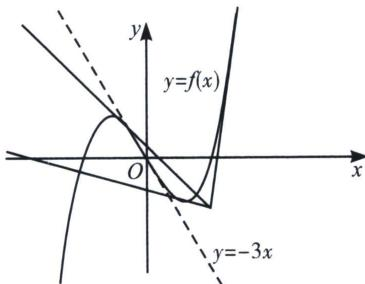

> [!faq]- 《导数专题(上册)》例题解析
>
> > [!success]- **【答案】** D
>
> > [!note]- **【分析】**
> > 本题未单列分析。
>
> > [!note]- **【解析】**
> > 解析 $f'(x)=3x^{2}-3,\quad f''(x)=6x=0$ ，故拐点为原点，且拐点切线为 y=-3x，我们作出图形，
> > 
> > 在拐点右侧，位于曲线下方拐点切线上方的区域，我们能作三条切线，两条与曲线切于拐点右侧的近切线，由于曲线处于下凹函数区间，切线切点附近区域都在曲线下方，一条绕过拐点，与曲线切于拐点左侧，由于拐点左侧区域曲线位于上凸区间，故切线都在曲线附近上方，所以 $-3m < n < m^3 - 3m$ 。
> >
> > 故选 **D**.
