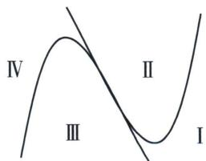

> [!faq]- 《导数专题(上册)》例题解析
>
> > [!success]- **【答案】** BCD
>
> > [!note]- **【解析】**
> > 解析 选项 A: $f'(x) = 2(x+1)$ , $f''(x) = 2 \neq 0$ , 根据拐点定义可知, $y = f(x)$ 没有拐点; 选项 B: $f'(x) = 3x^2 + 4x + 3$ , 即 $f''(x) = 6x + 4 = 0$ , 解得 $x = -\frac{2}{3}$ , 且 $x \in (-\infty, -\frac{2}{3})$ 时, $f''(x) < 0$ , $x \in \left(-\frac{2}{3}, +\infty\right)$ 时, $f''(x) > 0$ , 故 $\left(-\frac{2}{3}, f\left(-\frac{2}{3}\right)\right)$ 为 $y = f(x)$ 的拐点; 选项 C: $f'(x) = (x+1)e^x$ , 令 $f''(x) = (x+2)e^x = 0$ , 解得 $x = -2$ , 且 $x \in (-\infty, -2)$ 时, $f''(x) < 0$ , $x \in (-2, +\infty)$ 时, $f''(x) > 0$ , 故 $(-2, f(-2))$ 为 $y = f(x)$ 的拐点; 选项 D: $f'(x) = \frac{1}{x} + 2x + \cos x$ , $f''(x) = -\frac{1}{x^2} + 2 - \sin x$ , 因为 $f''\left(\frac{1}{2}\right) = -2 - \sin \frac{1}{2} < 0$ , $f''(1) = 1 - \sin 1 > 0$ , 所以 $\exists x_0 \in \left(\frac{1}{2}, 1\right)$ , 使得 $f''(x_0) = 0$ 成立, 由于 $f''(x_0)$ 在 $(0, +\infty)$ 是连续不断可导的, 所以 $f''(x_0)$ 在 $(0, +\infty)$ 有异号函数值, 故 $y = f(x)$ 存在拐点. 故选 BCD.
> >
> > ## 2. 三次函数切线条数
> >
> > 一般地，如图，过三次函数 $f(x)$ 图象的拐点 $\left(-\frac{b}{3a}, f\left(-\frac{b}{3a}\right)\right)$ （对称中心或拐点）作切线l，则坐标平面被切线l和函数 $f(x)$ 的图象分割为四个区域，有以下结论：
> >
> > (1)由于区域Ⅰ、Ⅳ属于外弧区域，故过区域Ⅰ、Ⅳ内的点作 $f(x)$ 的切线，有3条；
> >
> > (2)由于区域Ⅱ、Ⅲ属于内弧区域，过区域Ⅱ、Ⅲ内的点或者对称中心作 $f(x)$ 的切线，有且仅有1条；
> >
> > (3) 过切线 $l$ 或函数 $f(x)$ 图象 (除去对称中心) 上的点作 $f(x)$ 的切线, 有且仅有 2 条.
> >
> > 
