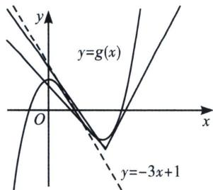
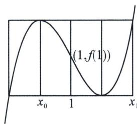

<!-- question-source:start -->
例11 (2023 枣庄二模·多选 T12) 已知函数 $f(x) = (x - 1)^{3} - ax - b + 1$ ，则下列结论正确的是（）

A. 当 $a = 3$ 时，若 $f(x)$ 有三个零点，则 $b$ 的取值范围为 $(-4, 0)$ B. 若 $f(x)$ 满足 $f(2 - x) = 3 - f(x)$ ，则 $a + b = -1$ C. 若过点 $(2, m)$ 可作出曲线 $g(x) = f(x) - 3x + ax + b$ 的三条切线，则 $-5 < m < -4$ D. 若 $f(x)$ 存在极值点 $x_{0}$ ，且 $f(x_{0}) = f(x_{1})$ ，其中 $x_{0} \neq x_{1}$ ，则 $x_{1} + 2x_{0} = 3$

(2)&=-4-b<0\end{aligned}\right.$ ，解得-4<b<0，所以b的取值范围为(-4,0)，因此A正确。
B. $f(x)$ 满足 $f(2-x)=3-f(x)$ ， $f(x)$ 关于点 $\left(1,\frac{3}{2}\right)$ 对称，则 $-a-b+1=\frac{3}{2}$ ，因此B不正确。
C. $g(x)=f(x)-3x+ax+b=x^{3}-3x^{2}$ ， $g'(x)=3x^{2}-6x$ ， $g''(x)=6x-6=0$ ，x=1，拐点(1,-2)，拐点处切线方程为 $y=-3x+1$ ，当x=2时，y=-5， $g
(2)=-4$ ，过点(2,m)可作出曲线 $g(x)=f(x)-3x+ax+b$ 的三条切线，如左图，则-5<m<-4，因此C正确。

D. 根据三次函数四段论，如图我们可得： $2(1-x_{0})=x_{1}-1,\quad x_{1}+2x_{0}=3$ ，因此 D 正确。故选 ACD.
<!-- question-source:end -->

![[高中/总复习/专题/2026版高中《mst老唐说题》导数专题（数学）/上册/第02章_技能篇_导数的切线方程/第二节_函数的切线界定/例题/answers/Q00046407A1.md]]
