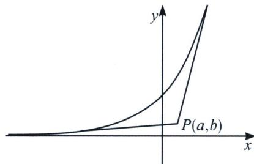

> [!faq]- 《导数专题(上)》例题解析
>
> > [!success]- **【答案】** D
>
> > [!note]- **【分析】**
> > 本题未单列分析。
>
> > [!note]- **【解析】**
> > 解析 法一：设过点 $(a,b)$ 的切线横坐标为t，则切线方程为 $b-e^{t}=e^{t}(a-t)$ ，可得 $b=e^{t}(a+1-t)$ ，设 $f(t)=e^{t}(a+1-t)$ ，可得 $f'(t)=e^{t}(a-t)$ ， $t\in(-\infty,a)$ ， $f'(t)>0$ ， $f(t)$ 是增函数， $t\in(a,+\infty)$ ， $f'(t)<0$ ， $f(t)$ 是减函数，因此当且仅当 $0<b<e^{a}$ 时，上述关于t的方程有两个实数解，对应两条切线，故选D.
> > 
> > 法二: (数形结合) 函数 $y = e^{x}$ 是增函数, 函数的图象如图, $y > 0$ , 即切点坐标在 $x$ 轴上方, 如果 $P(a, b)$ 在 $x$ 轴下方, 连线的斜率小于 0 时不成立, 故点 $P(a, b)$ 在 $x$ 轴或下方时, 只有一条切线. 如果 $P(a, b)$ 在曲线上, 只有一条切线; $P(a, b)$ 在曲线上侧, 没有切线; 由图象可知 $P(a, b)$ 在图象的下方, 并且在 $x$ 轴上方时, 有两条切线, 所以 $0 < b < e^{a}$ ,
> >
> > 故选 **D**.
